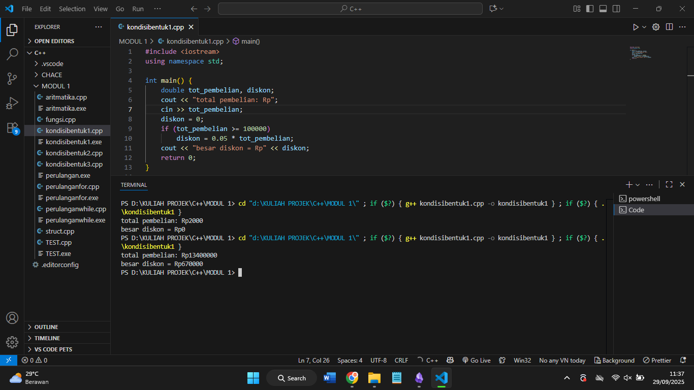

# Laporan Praktikum Stuktur Data MODUL 1 x Code block IDE dan Pengenalan Bahasa C++

Nama : Rifa Cahya Ariby 
NIM : 103112400268
Kelas : S1 IF12 07

---

## Dasar Teori

#### Code Blocks IDE
CodeBlocks adalah sebuah IDE lengkap yang dirancang untuk membantu pengembang, baik individu maupun tim, bekerja dalam lingkungan pemrograman yang efisien dengan semua fitur yang diperlukan untuk membuat program. CodeBlocks dikembangkan oleh tim Code::Blocks dan merupakan perangkat lunak sumber terbuka (open source) yang gratis serta dapat digunakan di berbagai platform.
#### Pengenalan bahasa C++

Bahasa pemrograman C++ dikembangkan oleh Bjarne Stroustrup sebagai perluasan dari bahasa C yang awalnya dibuat di Bell Labs oleh Dennis Ritchie pada tahun 1970-an. C++ merupakan bahasa pemrograman tingkat tinggi yang banyak digunakan untuk membuat berbagai jenis perangkat lunak, mulai dari aplikasi desktop, game komputer, hingga sistem operasi. Bahasa ini dikenal sangat fleksibel dan mendukung pemrograman terstruktur, di mana setiap bagian tugas program diorganisasi dalam blok-blok kode yang terpisah. Selain itu, C++ juga mendukung pemrograman berorientasi objek, sehingga memudahkan pengembang dalam mengelola dan mengembangkan program yang kompleks secara lebih efisien. C++ juga banyak digunakan dalam pengembangan perangkat lunak berperforma tinggi dan aplikasi yang membutuhkan kontrol langsung terhadap sumber daya komputer, seperti pemrograman sistem dan perangkat embedded. Fleksibilitas dan performanya membuat C++ tetap populer hingga saat ini di berbagai bidang teknologi.


## Guided

### 1. Test
``` cpp
#include <iostream>

using namespace std;

int main()

{

    string ch;

    cout << "Masukkan sebuah karakter: ";

    // cin >> ch;

    ch = getchar();  //Menggunakan getchar() untuk membaca satu karakter

    cout << "Karakter yang Anda masukkan adalah: " << ch << endl;

    return 0;

}
```
### output

Program di atas meminta input sebuah karakter dari pengguna menggunakan `getchar()` dan kemudian menampilkan karakter yang dimasukkan tersebut.

### 2. aritmatika
``` cpp
#include <iostream>

using namespace std;

int main()

{

    int W, X, Y;

    float Z;

    X = 7;

    Y = 3;

    W = 1;

    Z = (X + Y) / (Y + W);

    cout << "Nilai z = " << Z << endl;

    return 0;

}
```
### output

Program ini menjumlahkan nilai X dan Y, kemudian membaginya dengan hasil penjumlahan Y dan W. Karena semua variabel kecuali Z bertipe integer, operasi pembagian dilakukan sebagai pembagian bilangan bulat sehingga hasilnya dibulatkan sebelum disimpan ke variabel Z yang bertipe float. Program kemudian menampilkan nilai Z tersebut.

### 3. perulangan for & while
``` cpp
#include <iostream>

using namespace std;

int main() {

     int jum;

     cout << "jumlah perulangan: ";

     cin >> jum;

     for (int i = 0; i < jum; i++)

     {

        cout << "saya sahroni\n";

    }

    return 1;

}
```
### output

Program ini meminta pengguna memasukkan jumlah perulangan, lalu mencetak kalimat "saya sahroni" sebanyak jumlah yang dimasukkan menggunakan perulangan for. Setelah selesai, program mengembalikan nilai 1 sebagai tanda keluar.

``` cpp
#include <iostream>

using namespace std;

int main()

{

    int i = 1;

    int jum;

    cin >> jum;

    do

    {

        cout << "bahlil ke-" << (i + 1) << endl;

        i++;

    } while (i < jum);

    return 0;

}
```
### output

Program ini membaca nilai jum dari pengguna, lalu menggunakan perulangan do-while untuk mencetak teks "bahlil ke-" diikuti angka mulai dari 2 hingga (jum) selama i kurang dari jum. Variabel i bertambah setiap kali perulangan.


### 4. kondisi bentuk 1-3
``` cpp
#include <iostream>

using namespace std;

  

int main() {

    double tot_pembelian, diskon;

    cout << "total pembelian: Rp";

    cin >> tot_pembelian;

    diskon = 0;

    if (tot_pembelian >= 100000)

        diskon = 0.05 * tot_pembelian;

    cout << "besar diskon = Rp" << diskon;

    return 0;

}


#include <iostream>

using namespace std;

  

int main() {

    double tot_pembelian, diskon;

    cout << "total pembelian: Rp";

    cin >> tot_pembelian;

    if (tot_pembelian >= 100000)

        diskon = 0.05 * tot_pembelian;

    else

        diskon = 0;

    cout << "besar diskon = Rp" << diskon;

    return 0;

}
```
### output

Program ini meminta pengguna memasukkan total pembelian, lalu menghitung diskon 5% jika total pembelian sama dengan atau lebih dari 100.000. Setelah itu, program menampilkan besar diskon yang didapatkan.


``` cpp
#include <iostream>

using namespace std;

  

int main() {

    int kode_hari;

    cout << "Menentukan hari kerja/libur\n" << endl;

    cout << "1=Senin 3=Rabu 5=Jumat 7=Minggu " << endl;

    cout << "2=Selasa 4=Kamis 6=Sabtu " << endl;

    cin >> kode_hari;

  

    switch (kode_hari) {

    case 1:

    case 2:

    case 3:

    case 4:

    case 5:

        cout << "Hari Kerja";

        break;

    case 6:

    case 7:

        cout << "Hari Libur";

        break;

    default:

        cout << "Kode masukan salah!!!";

    }

    return 0;

}
```
### output


Program ini meminta pengguna memasukkan kode hari (1-7) lalu menggunakan switch untuk menentukan apakah hari tersebut hari kerja (kode 1-5) atau hari libur (kode 6-7). Jika kode tidak sesuai, program menampilkan pesan kesalahan.

``` cpp
#include <iostream>

#include <string>

using namespace std;

  

// Definisi struct

struct Mahasiswa {

    string nama;

    string nim;

    float ipk;

};

  

int main() {

  

    Mahasiswa mhs1;

  

    cout << "Masukkan Nama Mahasiswa: ";

    getline(cin, mhs1.nama);

    // cin >> mhs1.nama;

    cout << "Masukkan NIM Mahasiswa : ";

    cin >> mhs1.nim;

    cout << "Masukkan IPK Mahasiswa : ";

    cin >> mhs1.ipk;

  

    cout << "\n=== Data Mahasiswa ===" << endl;

    cout << "Nama : " << mhs1.nama << endl;

    cout << "NIM  : " << mhs1.nim << endl;

    cout << "IPK  : " << mhs1.ipk << endl;

  

    return 0;

}

```


### output

Program ini mendefinisikan sebuah struct bernama Mahasiswa untuk menyimpan tiga data: nama (string), NIM (string), dan IPK (float). Di fungsi utama, program meminta pengguna memasukkan nama mahasiswa menggunakan `getline` agar bisa membaca input dengan spasi, lalu input NIM dan IPK menggunakan `cin`. Setelah data dimasukkan, program menampilkan ulang data mahasiswa tersebut ke layar.

### 5. Fungsi

``` cpp
#include <iostream>

using namespace std;

  

// Prosedur: hanya menampilkan hasil, tidak mengembalikan nilai

void tampilkanHasil(double p, double l)

{

    cout << "\n=== Hasil Perhitungan ===" << endl;

    cout << "Panjang : " << p << endl;

    cout << "Lebar   : " << l << endl;

    cout << "Luas    : " << p * l << endl;

    cout << "Keliling: " << 2 * (p + l) << endl;

}

  

// Fungsi: mengembalikan nilai luas

double hitungLuas(double p, double l)

{

    return p * l;

}

  

// Fungsi: mengembalikan nilai keliling

double hitungKeliling(double p, double l)

{

    return 2 * (p + l);

}

  

int main()

{

    double panjang, lebar;

  

    cout << "Masukkan panjang: ";

    cin >> panjang;

    cout << "Masukkan lebar  : ";

    cin >> lebar;

  

    // Panggil fungsi

    double luas = hitungLuas(panjang, lebar);

    double keliling = hitungKeliling(panjang, lebar);

  

    cout << "\nDihitung dengan fungsi:" << endl;

    cout << "Luas      = " << luas << endl;

    cout << "Keliling  = " << keliling << endl;

  

    // Panggil prosedur

    tampilkanHasil(panjang, lebar);

  

    return 0;

}
```

### output

Program ini menghitung luas dan keliling persegi panjang dengan menggunakan fungsi dan prosedur. Fungsi `hitungLuas` dan `hitungKeliling` mengembalikan hasil perhitungan luas dan keliling, sedangkan prosedur `tampilkanHasil` hanya menampilkan hasil tanpa mengembalikan nilai. Program meminta input panjang dan lebar, lalu menampilkan hasil perhitungan dari fungsi dan prosedur tersebut.


## Unguided
### Soal 1

> 1. Buatlah program yang meminta inputan dua buah bilangan bertipe float, kemudian memberikan outputan hasil penjumlahan, pengurangan, perkalian dan pembagian dari dua bilangan tersebut.

``` cpp
#include <iostream>

using namespace std;

  

int main() {

    float a, b;

  

    cout << "masukkan bilangan pertama: ";

    cin >> a;

    cout << "masukkan bilangan kedua: ";

    cin >> b;

  

    cout << "penjumlahan: " << a + b << endl;

    cout << "pengurangan: " << a - b << endl;

    cout << "perkalian: " << a * b << endl;

  

    if (b != 0)

        cout << "pembagian: " << a / b << endl;

    else

        cout << "pembagian: tidak dapat dibagi nol" << endl;

  

    return 0;

}
```
### output

Program ini meminta pengguna memasukkan dua bilangan bertipe float, kemudian menampilkan hasil penjumlahan, pengurangan, perkalian, dan pembagian kedua bilangan tersebut. Jika bilangan kedua adalah nol, program memberikan pesan bahwa pembagian tidak dapat dilakukan.


### Soal 2

> 2. Buatlah sebuah program yang menerima masukan angka dan mengeluarkan output nilai angka tersebut dalam bentuk tulisan. Angka yang akan diinputkan user adalah bilangan bulat positif mulai dari 0 s.d 100
>    contoh 79 : tujuh puluh sembilan

``` cpp
#include <iostream>

using namespace std;

  

// Fungsi untuk mengubah angka menjadi teks

string angkaKeTeks(int angka) {

    string satuan[] = {"nol", "satu", "dua", "tiga", "empat", "lima", "enam", "tujuh", "delapan", "sembilan"};

    string belasan[] = {"sepuluh", "sebelas", "dua belas", "tiga belas", "empat belas",

                        "lima belas", "enam belas", "tujuh belas", "delapan belas", "sembilan belas"};

    string puluhan[] = {"", "", "dua puluh", "tiga puluh", "empat puluh", "lima puluh",

                        "enam puluh", "tujuh puluh", "delapan puluh", "sembilan puluh"};

  

    if (angka < 10) {

        return satuan[angka];

    }

    else if (angka < 20) {

        return belasan[angka - 10];

    }

    else if (angka < 100) {

        int p = angka / 10;  // puluhan

        int s = angka % 10;  // satuan

        if (s == 0)

            return puluhan[p];

        else

            return puluhan[p] + " " + satuan[s];

    }

    else if (angka == 100) {

        return "seratus";

    }

    else {

        return "harus diantara 0 dan 100!";

    }

}

  

int main() {

    int angka;

    cout << "masukkan angka (0-100): ";

    cin >> angka;

  

    if (angka < 0 || angka > 100) {

        cout << "angka harus diantara 0 dan 100!.";

    } else {

        cout << angka << " : " << angkaKeTeks(angka);

    }

  

    return 0;

}```
### output


Program ini menerima input angka antara 0 sampai 100, lalu mengubah angka tersebut menjadi kata dalam bahasa Indonesia menggunakan fungsi `angkaKeTeks`. Fungsi ini mengelompokkan angka menjadi satuan, belasan, puluhan, dan seratus, kemudian mengembalikan bentuk teks yang sesuai. Jika input di luar rentang, program menampilkan pesan kesalahan.

### Soal 3

> 3.  Buatlah program yang dapat memberikan input dan output sbb.


``` 
   Input: 3
   output:
	 3 2 1 * 1 2 3
	 2 1 * 1 2
	 1 * 1
	 *

```


``` cpp
#include <iostream>

using namespace std;

  

int main() {

    int n;

    cout << "Input: ";

    cin >> n;

    cout << "Output:" << endl;

  

    for (int i = n; i >= 1; i--) {

        // Cetak spasi di awal baris

        for (int s = 0; s < n - i; s++) {

            cout << "  ";

        }

  

        // Cetak angka menurun

        for (int j = i; j >= 1; j--) {

            cout << j << " ";

        }

  

        // Cetak bintang

        cout << "* ";

  

        // Cetak angka menaik

        for (int j = 1; j <= i; j++) {

            cout << j << " ";

        }

  

        cout << endl;

    }

  

    // Cetak baris terakhir hanya bintang (dengan spasi di awal)

    for (int s = 0; s < n; s++) {

        cout << "  ";

    }

    cout << "*" << endl;

  

    return 0;

}```
### output

Program ini menerima input angka n kemudian mencetak pola segitiga, setiap baris menampilkan spasi, angka menurun dari i ke 1, satu bintang, dan angka menaik dari 1 ke i, dengan i menurun dari n sampai 1. Setelah baris tersebut, program mencetak baris terakhir berisi spasi dan satu bintang sebagai penutup pola.

## referensi

1. Arista , I & Meini Sondang ,S. (2017) PENGEMBANGAN PLUGIN CODEBLOCKS DALAM PEMBELAJARAN BERBASIS PROYEK PADA MATA PELAJARAN PEMROGRAMAN DASAR UNTUKSISWA KELAS X BIDANG KEAHLIAN MULTIMEDIA SMKN 1 SURABAYA. https://ejournal.unesa.ac.id/index.php/it-edu/article/view/22637/20760
2. Rukman Gaffar (2021) Membuat aplikasi CRUD (Create,Read,Update,Dalate) menggunakan C++ . https://osf.io/preprints/osf/6nsdq
3. A Ritonga, Y Yahfizham (2023) Studi literatur perbandingan **bahasa** pemrograman **C++** dan **bahasa** pemrograman Python pada algoritma pemrograman. https://pdfs.semanticscholar.org/49e0/435b69105b8e4004fc891075f9ab00ef4aa1.pdf
4. M Zusane Oematan (2010) ### Pengenalan C/**c++** . https://repository.unikom.ac.id/33858/1/pendahuluan.doc