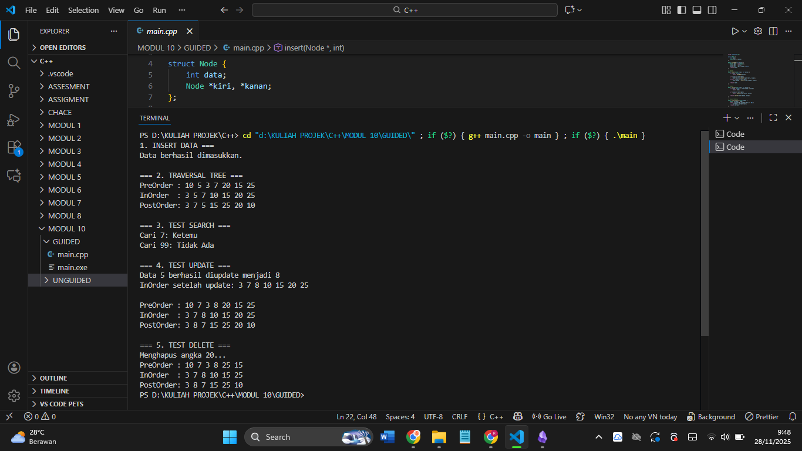
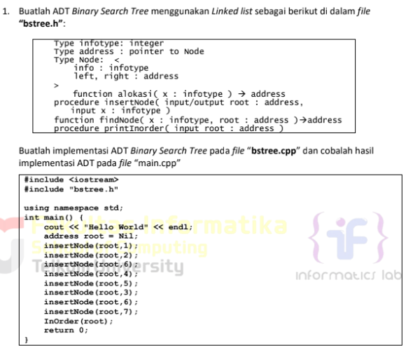
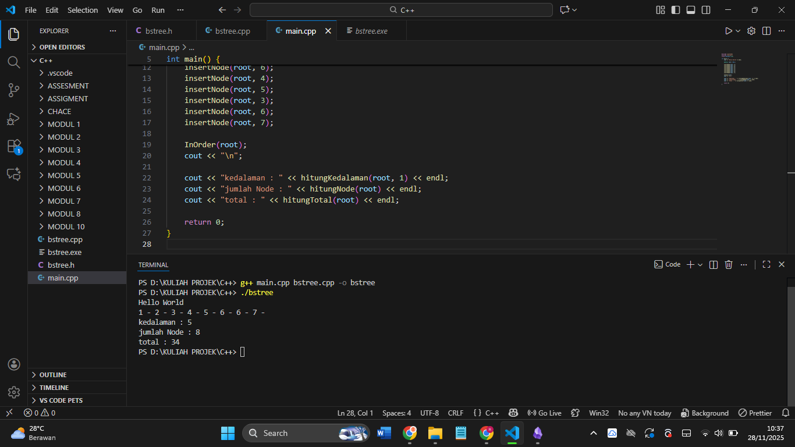
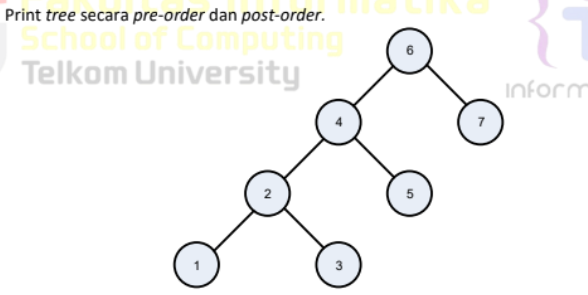

# Laporan Praktikum Stuktur Data MODUL 10 x Tree


Nama : Rifa Cahya Ariby 

NIM : 103112400268

Kelas : S1 IF12 07

---

## Dasar Teori

## Pengertian Binary Search Tree

Binary Search Tree (BST) merupakan struktur data berbentuk pohon biner di mana setiap node memiliki maksimal dua anak, yaitu kiri dan kanan, dengan aturan semua nilai di subtree kiri lebih kecil dari node root dan semua nilai di subtree kanan lebih besar dari node root. Struktur ini memungkinkan operasi pencarian, penyisipan, dan penghapusan data dengan efisiensi logaritmik O(log n) pada kasus rata-rata ketika pohon seimbang.

Setiap node BST menyimpan satu nilai unik beserta pointer ke anak kiri dan kanan, sehingga memenuhi sifat rekursif di mana subtree kiri dan kanan juga merupakan BST. Inorder traversal pada BST selalu menghasilkan urutan data yang terurut secara ascending karena sifat pengurutan alami dari struktur pohon ini.

## Operasi dalam BST

##  Search
Operasi search pada BST dimulai dari root, jika nilai dicari sama dengan root maka ditemukan, jika lebih kecil maka rekursif ke subtree kiri, jika lebih besar ke subtree kanan hingga menemukan node atau mencapai null. Proses ini memanfaatkan sifat pengurutan BST sehingga efisien dengan kompleksitas O(log n) rata-rata dan O(n) terburuk pada pohon tidak seimbang.​

##  Insert
Insert dilakukan dengan membandingkan nilai baru mulai dari root, jika lebih kecil rekursif ke kiri atau lebih besar ke kanan hingga menemukan posisi null untuk membuat node baru sambil mempertahankan sifat BST. Node baru selalu ditempatkan di leaf karena traversal mengikuti aturan kiri < root < kanan secara rekursif.​

##  Delete
Penghapusan node memiliki tiga kasus: leaf langsung dihapus, node dengan satu anak diganti anaknya, dan node dengan dua anak diganti successor inorder (nilai terkecil subtree kanan) lalu hapus successor tersebut. Setelah penggantian, subtree kanan diperbarui untuk menghapus duplikat successor sambil menjaga kestabilan struktur BST.​

## Operasi Traversal

### Preorder 
Preorder traversal mengunjungi node root terlebih dahulu, kemudian subtree kiri, dan terakhir subtree kanan. Polanya adalah root → kiri → kanan. Preorder sering digunakan untuk menyalin pohon atau membuat ekspresi prefix dari pohon ekspresi.​

### Postorder 
Postorder traversal mengunjungi subtree kiri dulu, kemudian subtree kanan, dan terakhir node root. Polanya adalah kiri → kanan → root. Postorder berguna untuk operasi menghapus pohon karena akan mengunjungi daun terlebih dahulu sebelum node induknya.​

### Inorder 
Inorder traversal mengunjungi subtree kiri, kemudian node root, dan terakhir subtree kanan (kiri → root → kanan). Ini menghasilkan urutan data terurut pada BST, sehingga umum digunakan untuk operasi sorting dan pencetakan data secara urut.


## Guided

### Soal 1
``` cpp
#include <iostream>

using namespace std;

  

struct Node {

    int data;

    Node *kiri, *kanan;

};

  

Node* buatNode(int nilai) {

    Node* baru = new Node();

    baru->data = nilai;

    baru->kiri = baru->kanan = NULL;

    return baru;

}

  

// INSERT

Node* insert(Node* root, int nilai) {

    if (root == NULL)

        return buatNode(nilai);

  

    if (nilai < root->data)

        root->kiri = insert(root->kiri, nilai);

    else if (nilai > root->data)

        root->kanan = insert(root->kanan, nilai);

  

    return root;

}

  

// SEARCH

Node* search(Node* root, int nilai) {

    if (root == NULL || root->data == nilai)

        return root;

  

    if (nilai < root->data)

        return search(root->kiri, nilai);

  

    return search(root->kanan, nilai);

}

  

// NILAI TERKECIL

Node* nilaiTerkecil(Node* node) {

    Node* current = node;

    while (current && current->kiri != NULL)

        current = current->kiri;

    return current;

}

  

// DELETE

Node* hapus(Node* root, int nilai) {

    if (root == NULL)

        return root;

  

    if (nilai < root->data)

        root->kiri = hapus(root->kiri, nilai);

  

    else if (nilai > root->data)

        root->kanan = hapus(root->kanan, nilai);

  

    else {

        // ditemukan

        if (root->kiri == NULL) {

            Node* temp = root->kanan;

            delete root;

            return temp;

        }

        else if (root->kanan == NULL) {

            Node* temp = root->kiri;

            delete root;

            return temp;

        }

  

        Node* temp = nilaiTerkecil(root->kanan);

        root->data = temp->data;

        root->kanan = hapus(root->kanan, temp->data);

    }

    return root; // penting!

}

  

// UPDATE

Node* update(Node* root, int lama, int baru) {

    if (search(root, lama) != NULL) {   // diperbaiki

        root = hapus(root, lama);

        root = insert(root, baru);

        cout << "Data " << lama << " berhasil diupdate menjadi " << baru << endl;

    } else {

        cout << "Data " << lama << " tidak ditemukan." << endl;

    }

    return root;

}

  

// TRAVERSAL

void preOrder(Node* root) {

    if (root != NULL) {

        cout << root->data << " ";

        preOrder(root->kiri);

        preOrder(root->kanan);

    }

}

  

void inOrder(Node* root) {

    if (root != NULL) {

        inOrder(root->kiri);

        cout << root->data << " ";

        inOrder(root->kanan);

    }

}

  

void postOrder(Node* root) {

    if (root != NULL) {

        postOrder(root->kiri);

        postOrder(root->kanan);

        cout << root->data << " ";

    }

}

  

int main() {

    Node* root = NULL;

  

    cout << "1. INSERT DATA ===" << endl;

    root = insert(root, 10);

    insert(root, 5);

    insert(root, 20);

    insert(root, 3);

    insert(root, 7);

    insert(root, 15);

    insert(root, 25);

  

    cout << "Data berhasil dimasukkan.\n\n";

  

    cout << "=== 2. TRAVERSAL TREE ===" << endl;

    cout << "PreOrder : "; preOrder(root); cout << endl;

    cout << "InOrder  : "; inOrder(root); cout << endl;

    cout << "PostOrder: "; postOrder(root); cout << endl << endl;

  

    cout << "=== 3. TEST SEARCH ===" << endl;

    int cari = 7, cari2 = 99;

    cout << "Cari " << cari  << ": " << (search(root, cari)  ? "Ketemu" : "Tidak Ada") << endl;

    cout << "Cari " << cari2 << ": " << (search(root, cari2) ? "Ketemu" : "Tidak Ada") << endl << endl;

  

    cout << "=== 4. TEST UPDATE ===" << endl;

    root = update(root, 5, 8);

    cout << "InOrder setelah update: "; inOrder(root); cout << endl << endl;

  

    cout << "PreOrder : "; preOrder(root); cout << endl;

    cout << "InOrder  : "; inOrder(root); cout << endl;

    cout << "PostOrder: "; postOrder(root); cout << endl << endl;

  

    cout << "=== 5. TEST DELETE ===" << endl;

    cout << "Menghapus angka 20..." << endl;

    root = hapus(root, 20);

  

    cout << "PreOrder : "; preOrder(root); cout << endl;

    cout << "InOrder  : "; inOrder(root); cout << endl;

    cout << "PostOrder: "; postOrder(root); cout << endl;

  

    return 0;

}

```

### Output


Program ini mengimplementasikan binary search tree (BST) dengan fungsi dasar seperti memasukkan data, mencari data, menghapus data, mengupdate nilai, dan menampilkan isi pohon menggunakan tiga metode traversal (preorder, inorder, dan postorder). Saat dijalankan, program akan menambah beberapa elemen ke dalam pohon, menampilkan seluruh data dengan berbagai cara traversal, melakukan pencarian nilai tertentu, mengganti nilai pada node yang ada, dan menghapus node, lalu menampilkan hasilnya setelah setiap operasi.


## Unguided
### Soal 1


### bstree.h
``` h
#ifndef BSTREE_H

#define BSTREE_H

  

typedef int infotype;

typedef struct Node* address;

  

struct Node {

    infotype info;

    address left;

    address right;

};

  

address alokasi(infotype x);

void insertNode(address &root, infotype x);

address findNode(infotype x, address root);

void printInOrder(address root);

  

#endif
```


### bstree.cpp

``` cpp
#include <iostream>

#include "bstree.h"

using namespace std;

  

// Membuat node baru

address alokasi(infotype x) {

    address p = new Node;

    p->info = x;

    p->left = NULL;

    p->right = NULL;

    return p;

}

  

// Insert node ke BST

void insertNode(address &root, infotype x) {

    if (root == NULL) {

        root = alokasi(x);

    }

    else if (x < root->info) {

        insertNode(root->left, x);

    }

    else if (x > root->info) {

        insertNode(root->right, x);

    }

}

  

// Mencari node

address findNode(infotype x, address root) {

    if (root == NULL) return NULL;

    if (x == root->info) return root;

    if (x < root->info) return findNode(x, root->left);

    return findNode(x, root->right);

}

  

// Cetak InOrder

void printInOrder(address root) {

    if (root != NULL) {

        printInOrder(root->left);

        cout << root->info << " - ";

        printInOrder(root->right);

    }

}
```
### main.cpp

``` cpp
#include <iostream>

#include "bstree.h"

using namespace std;

  

int main() {

    cout << "Hello world!" << endl;

  

    address root = NULL;

  

    insertNode(root, 1);

    insertNode(root, 2);

    insertNode(root, 3);

    insertNode(root, 4);

    insertNode(root, 5);

    insertNode(root, 6);

    insertNode(root, 7);

  

    printInOrder(root);

  

    return 0;

}
```

## Output


 
File pertama hanya berisi deklarasi struktur node beserta daftar fungsi BST yang akan digunakan di program utama. File kedua berisi logika lengkap BST termasuk cara membuat node baru, memasukkan data ke tree dengan aturan kiri lebih kecil dan kanan lebih besar, mencari data secara rekursif, serta mencetak tree menggunakan inorder traversal yang menghasilkan urutan terurut. File ketiga menjalankan program utama dengan membuat tree kosong, menambah beberapa data ke dalamnya, lalu mencetak hasil akhir menggunakan fungsi-fungsi dari file sebelumnya.


## Soal 2
Buatlah fungsi untuk menghitung jumlah node dengan fungsi berikut.
➢ fungsi hitungJumlahNode( root:address ) : integer
/* fungsi mengembalikan integer banyak node yang ada di dalam BST*/
➢ fungsi hitungTotalInfo( root:address, start:integer ) : integer
/* fungsi mengembalikan jumlah (total) info dari node-node yang ada di dalam BST*/
➢ fungsi hitungKedalaman( root:address, start:integer ) : integer
/* fungsi rekursif mengembalikan integer kedalaman maksimal dari binary tree */

``` cpp
int main() {
cout << "Hello World" << endl;
address root = Nil;
insertNode(root,1);
insertNode(root,2);
insertNode(root,6);
insertNode(root,4);
insertNode(root,5);
insertNode(root,3);
insertNode(root,6);
insertNode(root,7);
InOrder(root);
cout<<"\n";
cout<<"kedalaman : "<<hitungKedalaman(root,0)<<endl;
cout<<"jumlah Node : "<<hitungNode(root)<<endl;
cout<<"total : "<<hitungTotal(root)<<endl;
return 0;
}
```

### bstree.cpp
tambahkan

``` cpp
// no 2

  

int hitungNode(address root) {

    if (root == NULL) return 0;

    return 1 + hitungNode(root->left) + hitungNode(root->right);

}

  

int hitungTotal(address root) {

    if (root == NULL) return 0;

    return root->info + hitungTotal(root->left) + hitungTotal(root->right);

}

  

int hitungKedalaman(address root, int level) {

    if (root == NULL)

        return level - 1;      // karena level sudah masuk 1 kali

  

    int kiri  = hitungKedalaman(root->left, level + 1);

    int kanan = hitungKedalaman(root->right, level + 1);

  

    return max(kiri, kanan);

}
```

### bstree.h
tambahkan

``` h
// no 2

int hitungNode(address root);

int hitungTotal(address root);

int hitungKedalaman(address root, int start);
```
### main.cpp
tambahkan
``` cpp
#include <iostream>

#include "bstree.h"

using namespace std;

  

int main() {

    cout << "Hello world!" << endl;

  

    address root = NULL;

  

    insertNode(root, 1);

    insertNode(root, 2);

    insertNode(root, 3);

    insertNode(root, 4);

    insertNode(root, 5);

    insertNode(root, 6);

    insertNode(root, 7);

  

    printInOrder(root);

    // no 2

    cout << "kedalaman : " << hitungKedalaman(root, 1) << endl;

    cout << "jumlah Node : " << hitungNode(root) << endl;

    cout << "total : " << hitungTotal(root) << endl;

  

    return 0;

}
```

### Output



### Soal 3


tambahin di bstree.cpp
``` cpp
void PreOrder(address root) {
    if (root != NULL) {
        cout << root->info << " - ";   // visit root
        PreOrder(root->left);          // kiri
        PreOrder(root->right);         // kanan
    }
}

void PostOrder(address root) {
    if (root != NULL) {
        PostOrder(root->left);         // kiri
        PostOrder(root->right);        // kanan
        cout << root->info << " - ";   // visit root
    }
}

```

tambahin di bstree.h

``` h
void PreOrder(address root);
void PostOrder(address root);

```

tambahin di main.cpp
``` cpp
cout << "PreOrder : ";
PreOrder(root);
cout << "\n";

cout << "PostOrder : ";
PostOrder(root);
cout << "\n";

```

### Output
```
 pre order
6 - 4 - 2 - 1 - 3 - 5 - 7 -
 post order
 1 - 3 - 2 - 5 - 4 - 7 - 6 -

```

## Referensi
1. Modul Praktikum
2. https://yuliana.lecturer.pens.ac.id/Struktur%20Data/PRAKTIKUM%202015/Praktikum%2027%20-%20BinarySearchTree%201.pdf
3. https://abdilahrf.github.io/2015/06/pengenalan-binary-search-tree/
4. https://www.mahirkoding.com/struktur-data-binary-search-tree-bst/
5. https://id.scribd.com/doc/248614322/Binary-Search-Tree
6. https://id.scribd.com/document/648464486/MODUL-14-Binary-Search-Tree-1
7. https://www.geeksforgeeks.org/dsa/binary-search-tree-traversal-inorder-preorder-post-order/