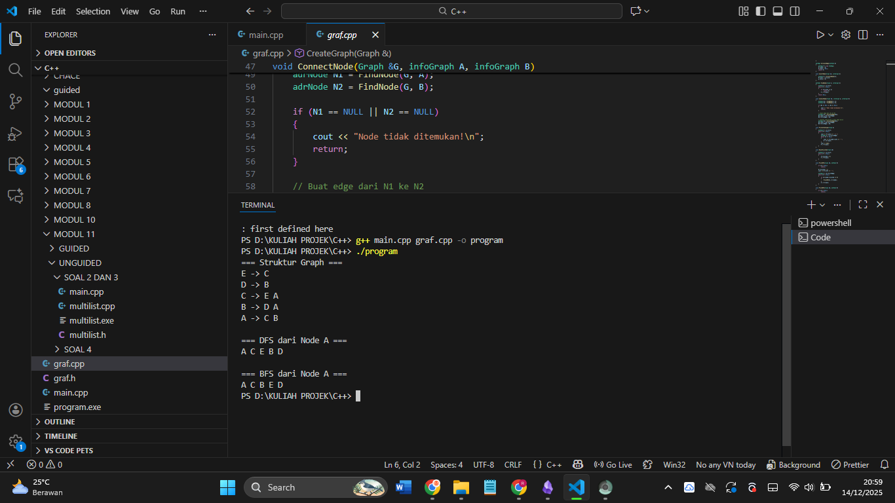
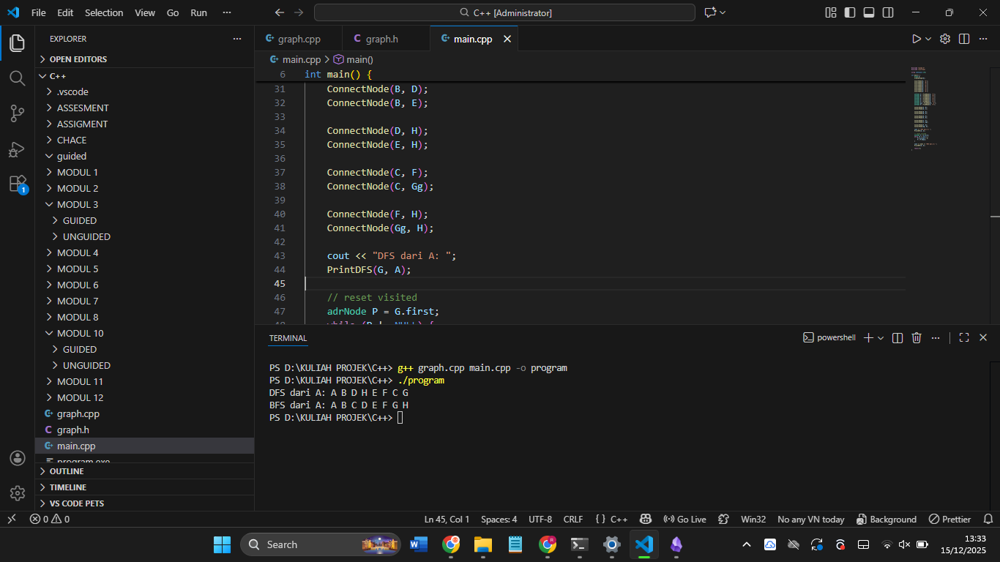

# Laporan Praktikum Stuktur Data MODUL 12 x Graph


Nama : Rifa Cahya Ariby 

NIM : 103112400268

Kelas : S1 IF12 07

---

## Dasar Teori
### Graph

Graph didefinisikan sebagai pasangan himpunan G=(V,E)G=(V,E), di mana VV adalah kumpulan simpul dan EE adalah kumpulan sisi yang menghubungkan pasangan simpul. Sisi bisa berarah (directed graph, seperti panah dari satu simpul ke simpul lain) atau tak berarah (undirected graph, hubungan dua arah tanpa arah spesifik). Representasi umum mencakup matriks ketetanggaan untuk graph padat dan daftar ketetanggaan untuk graph jarang, memengaruhi efisiensi ruang dan waktu.​

### Manfaat dan Metode Penerapan

Graph unggul dalam menganalisis relasi dinamis nonlinier, seperti topologi jaringan komputer untuk routing efisien atau analisis jejaring sosial untuk teman terdekat. Algoritma kunci termasuk DFS (Depth-First Search) dan BFS (Breadth-First Search) untuk pencarian, serta Bellman-Ford untuk jalur terpendek. Kelebihannya meliputi visualisasi masalah kompleks dan implementasi algoritma pencarian canggih, meski tantangan seperti kompleksitas komputasi tinggi pada graph besar perlu diatasi.

## Guided


### graf.h

```h
#ifndef GRAF_H_INCLUDED

#define GRAF_H_INCLUDED

  

#include <iostream>

using namespace std;

  

typedef char infoGraph;

  

struct ElmNode;

struct ElmEdge;

  

typedef ElmNode *adrNode;

typedef ElmEdge *adrEdge;

  

struct ElmNode

{

    infoGraph info;

    int visited;

    adrEdge firstEdge;

    adrNode next;

};

  

struct ElmEdge

{

    adrNode node;

    adrEdge next;

};

  

struct Graph

{

    adrNode first;

};

  

// PRIMITIF GRAPH

void CreateGraph(Graph &G);

adrNode AllocateNode(infoGraph X);

adrEdge AllocateEdge(adrNode N);

  

void InsertNode(Graph &G, infoGraph X);

adrNode FindNode(Graph G, infoGraph X);

  

void ConnectNode(Graph &G, infoGraph A, infoGraph B);

  

void PrintInfoGraph(Graph G);

  

// Traversal

void ResetVisited(Graph &G);

void PrintDFS(Graph &G, adrNode N);

void PrintBFS(Graph &G, adrNode N);

  

#endif
```


### graf.cpp


``` cpp
#include "graf.h"

#include <queue>

#include <stack>

  

void CreateGraph(Graph &G)

{

    G.first = NULL;

}

  

adrNode AllocateNode(infoGraph X)

{

    adrNode P = new ElmNode;

    P->info = X;

    P->visited = 0;

    P->firstEdge = NULL;

    P->next = NULL;

    return P;

}

  

adrEdge AllocateEdge(adrNode N)

{

    adrEdge P = new ElmEdge;

    P->node = N;

    P->next = NULL;

    return P;

}

  

void InsertNode(Graph &G, infoGraph X)

{

    adrNode P = AllocateNode(X);

    P->next = G.first;

    G.first = P;

}

  

adrNode FindNode(Graph G, infoGraph X)

{

    adrNode P = G.first;

    while (P != NULL)

    {

        if (P->info == X)

            return P;

        P = P->next;

    }

    return NULL;

}

  

void ConnectNode(Graph &G, infoGraph A, infoGraph B)

{

    adrNode N1 = FindNode(G, A);

    adrNode N2 = FindNode(G, B);

  

    if (N1 == NULL || N2 == NULL)

    {

        cout << "Node tidak ditemukan!\n";

        return;

    }

  

    // Buat edge dari N1 ke N2

    adrEdge E1 = AllocateEdge(N2);

    E1->next = N1->firstEdge;

    N1->firstEdge = E1;

  

    // Karena undirected → buat edge balik

    adrEdge E2 = AllocateEdge(N1);

    E2->next = N2->firstEdge;

    N2->firstEdge = E2;

}

  

void PrintInfoGraph(Graph G)

{

    adrNode P = G.first;

    while (P != NULL)

    {

        cout << P->info << " -> ";

        adrEdge E = P->firstEdge;

        while (E != NULL)

        {

            cout << E->node->info << " ";

            E = E->next;

        }

        cout << endl;

        P = P->next;

    }

}

  

void ResetVisited(Graph &G)

{

    adrNode P = G.first;

    while (P != NULL)

    {

        P->visited = 0;

        P = P->next;

    }

}

  

void PrintDFS(Graph &G, adrNode N)

{

    if (N == NULL)

        return;

  

    N->visited = 1;

    cout << N->info << " ";

  

    adrEdge E = N->firstEdge;

    while (E != NULL)

    {

        if (E->node->visited == 0)

        {

            PrintDFS(G, E->node);

        }

        E = E->next;

    }

}

  

void PrintBFS(Graph &G, adrNode N)

{

    if (N == NULL)

        return;

  

    queue<adrNode> Q;

    Q.push(N);

  

    while (!Q.empty())

    {

        adrNode curr = Q.front();

        Q.pop();

  

        if (curr->visited == 0)

        {

            curr->visited = 1;

            cout << curr->info << " ";

  

            adrEdge E = curr->firstEdge;

            while (E != NULL)

            {

                if (E->node->visited == 0)

                {

                    Q.push(E->node);

                }

                E = E->next;

            }

        }

    }

}
```


### main.cpp

``` cpp
#include "graf.h"

#include <iostream>

using namespace std;

  

int main()

{

    Graph G;

    CreateGraph(G);

  

    // Tambah node

    InsertNode(G, 'A');

    InsertNode(G, 'B');

    InsertNode(G, 'C');

    InsertNode(G, 'D');

    InsertNode(G, 'E');

  

    // Hubungkan node (graph tidak berarah)

    ConnectNode(G, 'A', 'B');

    ConnectNode(G, 'A', 'C');

    ConnectNode(G, 'B', 'D');

    ConnectNode(G, 'C', 'E');

  

    cout << "=== Struktur Graph ===\n";

    PrintInfoGraph(G);

  

    cout << "\n=== DFS dari Node A ===\n";

    ResetVisited(G);

    PrintDFS(G, FindNode(G, 'A'));

  

    cout << "\n\n=== BFS dari Node A ===\n";

    ResetVisited(G);

    PrintBFS(G, FindNode(G, 'A'));

  

    cout << endl;

    return 0;

}
```

## output




> Program di atas adalah program C++ yang digunakan untuk membuat dan mengelola struktur data graph tidak berarah (undirected graph) dengan representasi adjacency list.
> Program ini:
> - Membuat graph kosong
> - Menambahkan beberapa node (A, B, C, D, E)
> - Menghubungkan node satu dengan yang lain menggunakan edge dua arah
> - Menampilkan struktur graph
> - Melakukan traversal DFS (Depth First Search) dan BFS (Breadth First Search) mulai dari node A
> Singkatnya, program ini menunjukkan cara membuat graph, menghubungkan node, dan menelusuri graph menggunakan DFS dan BFS.


## Unguided


1. Buatlah ADT Graph tidak berarah file “graph.h”:

```
Type infoGraph: char
Type adrNode : pointer to ElmNode
Type adrEdge : pointer to ElmNode
Type ElmNode <
info : infoGraph
visited : integer
firstEdge : adrEdge
Next : adrNode
>
Type ElmEdge <
Node : adrNode
Next : adrEdge
>
Type Graph <
first : adrNode
>
procedure CreateGraph (input/output G : Graph)
procedure InsertNode (input/output G : Graph,
input X : infotype)
procedure ConnectNode (input/output N1, N2 : adrNode)
procedure PrintInfoGraph (input G : Graph)
```

Buatlah implementasi ADT Graph pada file “graph.cpp” dan cobalah hasil implementasi ADT
pada file “main.cpp”.

2.  Buatlah prosedur untuk menampilkanhasil penelusuran DFS.
   prosedur PrintDFS (Graph G, adrNode N);

3. Buatlah prosedur untuk menampilkanhasil penelusuran DFS.
prosedur PrintBFS (Graph G, adrNode N);


## Kode Program


### graph.h

``` h
#ifndef GRAPH_H

#define GRAPH_H

  

#include <iostream>

using namespace std;

  

typedef char infoGraph;

  

typedef struct ElmNode *adrNode;

typedef struct ElmEdge *adrEdge;

  

struct ElmEdge {

    adrNode Node;

    adrEdge Next;

};

  

struct ElmNode {

    infoGraph info;

    int visited;

    adrEdge firstEdge;

    adrNode Next;

};

  

struct Graph {

    adrNode first;

};

  

void CreateGraph(Graph &G);

void InsertNode(Graph &G, infoGraph X);

adrNode FindNode(Graph G, infoGraph X);

void ConnectNode(adrNode N1, adrNode N2);

void PrintInfoGraph(Graph G);

void PrintDFS(Graph &G, adrNode N);

void PrintBFS(Graph &G, adrNode N);

  

#endif
```


### graph.cpp

``` cpp
#include "graph.h"

#include <queue>

#include <cstddef>

  

// Membuat graph kosong

void CreateGraph(Graph &G) {

    G.first = NULL;

}

  

// Menambahkan node ke graph

void InsertNode(Graph &G, infoGraph X) {

    adrNode P = new ElmNode;

    P->info = X;

    P->visited = 0;

    P->firstEdge = NULL;

    P->Next = NULL;

  

    if (G.first == NULL) {

        G.first = P;

    } else {

        adrNode Q = G.first;

        while (Q->Next != NULL) {

            Q = Q->Next;

        }

        Q->Next = P;

    }

}

  

// Mencari node

adrNode FindNode(Graph G, infoGraph X) {

    adrNode P = G.first;

    while (P != NULL) {

        if (P->info == X)

            return P;

        P = P->Next;

    }

    return NULL;

}

  

// Menghubungkan dua node (tidak berarah, insert di AKHIR)

void ConnectNode(adrNode N1, adrNode N2) {

    if (N1 != NULL && N2 != NULL) {

        adrEdge E1 = new ElmEdge;

        E1->Node = N2;

        E1->Next = NULL;

  

        if (N1->firstEdge == NULL) {

            N1->firstEdge = E1;

        } else {

            adrEdge Q = N1->firstEdge;

            while (Q->Next != NULL)

                Q = Q->Next;

            Q->Next = E1;

        }

  

        adrEdge E2 = new ElmEdge;

        E2->Node = N1;

        E2->Next = NULL;

  

        if (N2->firstEdge == NULL) {

            N2->firstEdge = E2;

        } else {

            adrEdge R = N2->firstEdge;

            while (R->Next != NULL)

                R = R->Next;

            R->Next = E2;

        }

    }

}

  

// Menampilkan adjacency list

void PrintInfoGraph(Graph G) {

    adrNode P = G.first;

    while (P != NULL) {

        cout << P->info << " -> ";

        adrEdge E = P->firstEdge;

        while (E != NULL) {

            cout << E->Node->info << " ";

            E = E->Next;

        }

        cout << endl;

        P = P->Next;

    }

}

  

// DFS

void PrintDFS(Graph &G, adrNode N) {

    if (N == NULL || N->visited == 1)

        return;

  

    cout << N->info << " ";

    N->visited = 1;

  

    adrEdge E = N->firstEdge;

    while (E != NULL) {

        PrintDFS(G, E->Node);

        E = E->Next;

    }

}

  

// BFS

void PrintBFS(Graph &G, adrNode N) {

    if (N == NULL)

        return;

  

    queue<adrNode> Q;

    N->visited = 1;

    Q.push(N);

  

    while (!Q.empty()) {

        adrNode P = Q.front();

        Q.pop();

        cout << P->info << " ";

  

        adrEdge E = P->firstEdge;

        while (E != NULL) {

            if (E->Node->visited == 0) {

                E->Node->visited = 1;

                Q.push(E->Node);

            }

            E = E->Next;

        }

    }

}
```


### main.cpp
``` cpp
#include "graph.h"

#include <iostream>

  

using namespace std;

  

int main() {

    Graph G;

    CreateGraph(G);

  

    InsertNode(G, 'A');

    InsertNode(G, 'B');

    InsertNode(G, 'C');

    InsertNode(G, 'D');

    InsertNode(G, 'E');

    InsertNode(G, 'F');

    InsertNode(G, 'G');

    InsertNode(G, 'H');

  

    adrNode A = FindNode(G, 'A');

    adrNode B = FindNode(G, 'B');

    adrNode C = FindNode(G, 'C');

    adrNode D = FindNode(G, 'D');

    adrNode E = FindNode(G, 'E');

    adrNode F = FindNode(G, 'F');

    adrNode Gg = FindNode(G, 'G');

    adrNode H = FindNode(G, 'H');

  

    ConnectNode(A, B);

    ConnectNode(A, C);

  

    ConnectNode(B, D);

    ConnectNode(B, E);

  

    ConnectNode(D, H);

    ConnectNode(E, H);

  

    ConnectNode(C, F);

    ConnectNode(C, Gg);

  

    ConnectNode(F, H);

    ConnectNode(Gg, H);

  

    cout << "DFS dari A: ";

    PrintDFS(G, A);

  

    // reset visited

    adrNode P = G.first;

    while (P != NULL) {

        P->visited = 0;

        P = P->Next;

    }

  

    cout << endl << "BFS dari A: ";

    PrintBFS(G, A);

  

    return 0;

}
```


## output


> Program di atas merupakan implementasi ADT Graph tidak berarah dengan representasi adjacency list. Graph terdiri dari node dan edge, di mana setiap node menyimpan informasi, status kunjungan (visited), serta daftar sisi yang terhubung dengannya. Program menyediakan operasi dasar seperti membuat graph, menambahkan node, menghubungkan antar node, serta menampilkan isi graph. Selain itu, diimplementasikan dua metode penelusuran graf, yaitu Depth First Search (DFS) dan Breadth First Search (BFS) yang dimulai dari simpul A. DFS menelusuri graf secara mendalam terlebih dahulu, sedangkan BFS menelusuri graf secara melebar berdasarkan level, sehingga menghasilkan urutan penelusuran yang berbeda sesuai karakteristik masing-masing metode.


## Referensi
1. Modul Praktikum
2. https://bif.telkomuniversity.ac.id/mengenal-struktur-data-graph-definisi-dan-manfaat/
3. https://www.exabytes.co.id/blog/jenis-struktur-data-graph-dan-penerapannya/
4. https://www.trivusi.web.id/2022/07/struktur-data-graph.html


