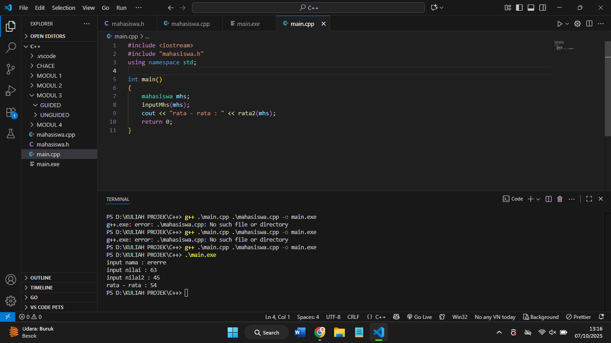
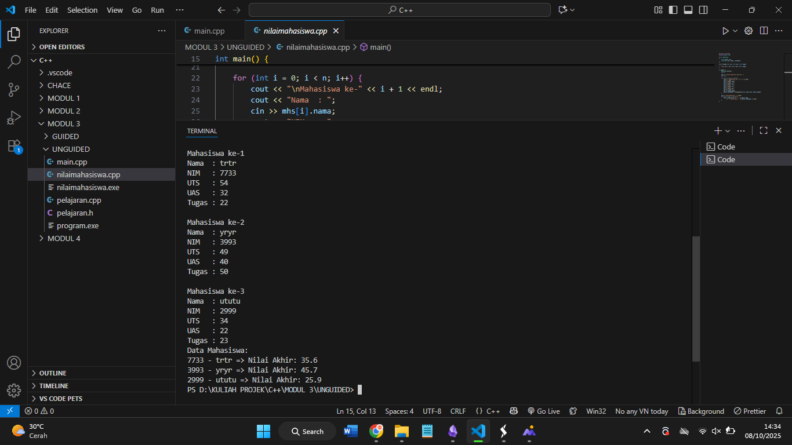
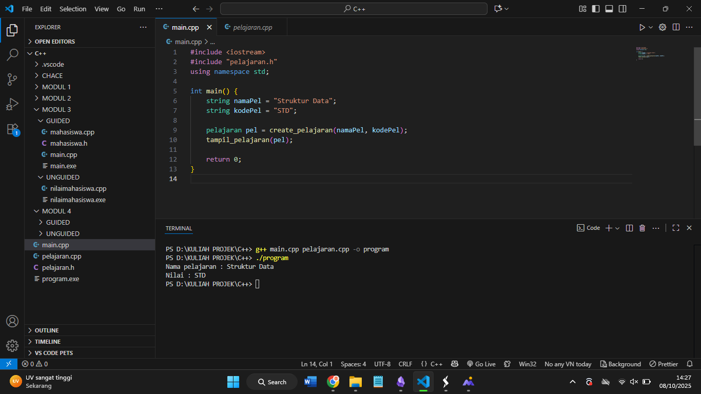
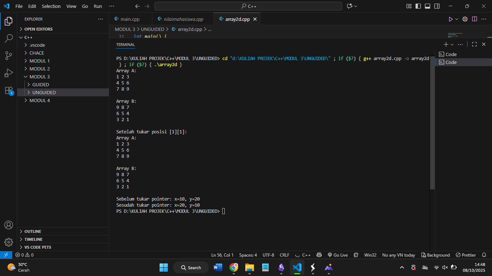

#  Laporan Praktikum Stuktur Data MODUL 3 x Abstract Data Tipe (ADT)

Nama : Rifa Cahya Ariby 

NIM : 103112400268

Kelas : S1 IF12 07

---

## Dasar Teori 

Tipe Data Abstrak (ADT) merupakan model struktur data yang mendeskripsikan suatu tipe data berdasarkan perilaku dan operasi yang dapat dilakukan terhadapnya, tanpa memperhatikan cara implementasinya. Konsep ini memisahkan penggunaan dan detail implementasi, sehingga pengembang dapat berfokus pada fungsi dan karakteristik matematisnya, bukan pada cara kerjanya secara internal.
Singkatnya, ADT adalah model tipe data yang:
- Mendefinisikan _apa_ yang bisa dilakukan dengan data, bukan _bagaimana_ caranya.
- Menyembunyikan detail implementasi (abstraksi dan enkapsulasi), hanya memberi tahu antarmuka dan perilaku.
- Memungkinkan programmer membuat tipe data khusus yang sesuai kebutuhan tanpa bergantung pada struktur penyimpanan spesifik.

Contoh sederhana ADT adalah tipe data seperti List, Stack, atau Queue, yang meskipun dapat diimplementasikan dengan cara berbeda, tetap memiliki operasi dasar yang sama seperti menambah, menghapus, atau melihat elemen.
## Guided

### mahasiswa.h

``` h
#ifndef MAHASISWA_H_INCLUDED

#define MAHASISWA_H_INCLUDED

  

struct mahasiswa

{

    char nim[10];

    int nilai1, nilai2;

};

  

void inputMhs (mahasiswa &m);

float rata2 (mahasiswa m);

  

#endif
```

> - `#ifndef`, `#define`, `#endif` → disebut header guard, mencegah file `mahasiswa.h` di-include lebih dari sekali.
> 
> - `struct mahasiswa` → mendefinisikan tipe data baru bernama `mahasiswa` dengan atribut `nim`, `nilai1`, dan `nilai2`.
> 
> - `void inputMhs(mahasiswa &m);` → deklarasi fungsi untuk menginput data mahasiswa (dikirim by reference).
> 
> - `float rata2(mahasiswa m);` → deklarasi fungsi untuk menghitung rata-rata nilai mahasiswa.

### mahasiswa.cpp
``` cpp
#include "mahasiswa.h"

#include <iostream>

using namespace std;

  

void inputMhs (mahasiswa &m) {

    cout << "input nama : ";

    cin >> (m).nim;

    cout << "input nilai : ";

    cin >> (m).nilai1;

    cout << "input nilai2 : ";

    cin >> (m).nilai2;

}

  

float rata2 (mahasiswa m)

{

    return float (m.nilai1 + m.nilai2) / 2;

}
```

> File **`mahasiswa.h`** berisi **deklarasi struktur dan fungsi**, yaitu `struct mahasiswa` (menyimpan `nim`, `nilai1`, dan `nilai2`), serta deklarasi fungsi `inputMhs()` dan `rata2()`.  
> Sedangkan **`mahasiswa.cpp`** berisi **implementasi fungsinya**: `inputMhs()` digunakan untuk meminta data mahasiswa dari pengguna, dan `rata2()` menghitung serta mengembalikan nilai rata-rata dari dua nilai yang diinput.

### main.cpp
``` cpp
#include <iostream>

#include "mahasiswa.h"

using namespace std;

  

int main()

{

    mahasiswa mhs;

    inputMhs(mhs);

    cout << "rata - rata : " << rata2(mhs);

    return 0;

}
```

> File **`main.cpp`** adalah **program utama** yang **menggunakan** kode dari file `mahasiswa.h` dan `mahasiswa.cpp`.
> 
> - `#include "mahasiswa.h"` memungkinkan `main.cpp` mengenali struktur `mahasiswa` serta fungsi `inputMhs()` dan `rata2()`.
>     
> - Di fungsi `main()`, objek `mhs` dibuat dari struct `mahasiswa`, kemudian `inputMhs(mhs)` dipanggil untuk mengisi datanya, dan hasilnya ditampilkan dengan `rata2(mhs)`.


### Output ketika ketiga program di atas dijalankan


Dijalankan dengan perintah  

``` terminal
g++ .\main.cpp .\mahasiswa.cpp -o main.exe

Menggabungkan dua file .cpp menjadi satu program (main.exe)

.\main.exe

```




## Unguided

### Soal 1
Buat program yang dapat menyimpan data mahasiswa (max. 10) ke dalam sebuah array
dengan field nama, nim, uts, uas, tugas, dan nilai akhir. Nilai akhir diperoleh dari FUNGSI
dengan rumus 0.3*uts+0.4*uas+0.3*tugas.

``` cpp
#include <iostream>

using namespace std;

  

struct Mahasiswa

{

    string nama, nim;

    float uts, uas, tugas, nilaiAkhir;

};

  

float hitung(float uts, float uas, float tugas)

 {

    return 0.3 * uts + 0.4 * uas + 0.3 * tugas;

}

  

int main() {

    Mahasiswa mhs[10];

    int n;

  

    cout << "Jumlah mahasiswa (maks 10): ";

    cin >> n;

  

    for (int i = 0; i < n; i++) {

        cout << "\nMahasiswa ke-" << i + 1 << endl;

        cout << "Nama  : ";

        cin >> mhs[i].nama;

        cout << "NIM   : ";

        cin >> mhs[i].nim;

        cout << "UTS   : ";

        cin >> mhs[i].uts;

        cout << "UAS   : ";

        cin >> mhs[i].uas;

        cout << "Tugas : ";

        cin >> mhs[i].tugas;

        mhs[i].nilaiAkhir = hitung(mhs[i].uts, mhs[i].uas, mhs[i].tugas);

    }

  

    cout << "Data Mahasiswa: " << endl;

    for (int i = 0; i < n; i++) {

        cout << mhs[i].nim << " - " << mhs[i].nama

             << " => Nilai Akhir: " << mhs[i].nilaiAkhir << endl;

    }

}
```

### Output



> Program ini menyimpan data mahasiswa dalam array, meminta input nama, NIM, dan nilai UTS, UAS, serta tugas. Nilai akhir dihitung dengan fungsi berdasarkan rumus 0.3×UTS + 0.4×UAS + 0.3×Tugas. Setelah semua data dimasukkan, program menampilkan NIM, nama, dan nilai akhir tiap mahasiswa.


### Soal 2
Buatlah ADT pelajaran sebagai berikut di dalam file “pelajaran.h”:
``` cpp
Type pelajaran <
	namaMapel : string
	kodeMapel : string
>
	function create_pelajaran( namapel : string,
	kodepel : string ) → pelajaran
	procedure tampil_pelajaran( input pel : pelajaran )
```
Buatlah implementasi ADT pelajaran pada file “pelajaran.cpp”
Cobalah hasil implementasi ADT pada file “main.cpp”

``` cpp
using namespace std;
int main(){
string namapel = "Struktur Data";
string kodepel = "STD";
pelajaran pel = create_pelajaran(namapel,kodepel);
tampil_pelajaran(pel);
return 0;
}
```

Contoh output hasil:

``` terminal

Nama pelajaran : Struktur data
Nilai : STD
```


### pelajaran.h
``` cpp
#ifndef PELAJARAN_H

#define PELAJARAN_H

  

#include <iostream>

using namespace std;

  

struct pelajaran {

    string namaMapel;

    string kodeMapel;

};

  

pelajaran create_pelajaran(string namaPel, string kodePel);

void tampil_pelajaran(pelajaran pel);

  

#endif
```

### pelajaran.cpp
``` cpp
#include "pelajaran.h"

  

pelajaran create_pelajaran(string namaPel, string kodePel)

{

    pelajaran p;

    p.namaMapel = namaPel;

    p.kodeMapel = kodePel;

    return p;

}

  

void tampil_pelajaran(pelajaran pel)

{

    cout << "Nama pelajaran : " << pel.namaMapel << endl;

    cout << "Nilai : " << pel.kodeMapel << endl;

}
```


### main.cpp
``` cpp
#include <iostream>

#include "pelajaran.h"

using namespace std;

  

int main() {

    string namaPel = "Struktur Data";

    string kodePel = "STD";

  

    pelajaran pel = create_pelajaran(namaPel, kodePel);

    tampil_pelajaran(pel);

  

    return 0;

}
```


### Output



> Program tersebut terdiri dari tiga file yang saling berhubungan. File **pelajaran.h** berfungsi sebagai tempat deklarasi ADT (Abstract Data Type) yang mendefinisikan struktur data bernama _pelajaran_ dengan atribut `namaMapel` dan `kodeMapel`, serta mendeklarasikan fungsi dan prosedur yang akan digunakan, yaitu `create_pelajaran` dan `tampil_pelajaran`. Selanjutnya, file **pelajaran.cpp** berisi implementasi dari fungsi-fungsi yang dideklarasikan di header tersebut, di mana `create_pelajaran` digunakan untuk membuat atau mengisi data pelajaran baru, sedangkan `tampil_pelajaran` berfungsi menampilkan data pelajaran ke layar. Terakhir, file **main.cpp** merupakan program utama yang memanfaatkan ADT tersebut dengan cara memanggil fungsi-fungsi dari `pelajaran.h` untuk dijalankan, seperti membuat objek pelajaran dan menampilkannya. Dengan demikian, ketiga file ini saling terhubung membentuk satu kesatuan program, di mana `pelajaran.h` berperan sebagai rancangan, `pelajaran.cpp` sebagai pelaksana logika, dan `main.cpp` sebagai pengendali utama jalannya program.


### Soal 3

Buatlah program dengan ketentuan :
- 2 buah array 2D integer berukuran 3x3 dan 2 buah pointer integer
- fungsi/prosedur yang menampilkan isi sebuah array integer 2D
- fungsi/prosedur yang akan menukarkan isi dari 2 array integer 2D pada posisi tertentu
- fungsi/prosedur yang akan menukarkan isi dari variabel yang ditunjuk oleh 2 buah pointer

``` cpp
#include <iostream>

using namespace std;

  

struct Array2D{

    int data[3][3];

};

  

// Menampilkan isi array 2D

void tampil(Array2D A) {

    for (int i = 0; i < 3; i++) {

        for (int j = 0; j < 3; j++)

            cout << A.data[i][j] << " ";

        cout << endl;

    }

}

  

// Menukar isi dua array 2D pada posisi tertentu

void tukarPosisi(Array2D &A, Array2D &B, int i, int j) {

    int temp = A.data[i][j];

    A.data[i][j] = B.data[i][j];

    B.data[i][j] = temp;

}

  

// Menukar isi variabel yang ditunjuk oleh dua pointer

void tukarPointer(int *p1, int *p2) {

    int temp = *p1;

    *p1 = *p2;

    *p2 = temp;

}

  

int main() {

    Array2D A = {{{1,2,3},{4,5,6},{7,8,9}}};

    Array2D B = {{{9,8,7},{6,5,4},{3,2,1}}};

    int x = 10, y = 20;

    int *p1 = &x, *p2 = &y;

  

    cout << "Array A:" << endl;

    tampil(A);

    cout << endl << "Array B:" << endl;

    tampil(B);

  

    tukarPosisi(A, B, 1, 1);

  

    cout << endl << "Setelah tukar posisi [1][1]:" << endl;

    cout << "Array A:" << endl;

    tampil(A);

    cout << endl << "Array B:" << endl;

    tampil(B);

  

    cout << endl << "Sebelum tukar pointer: x=" << x << ", y=" << y << endl;

    tukarPointer(p1, p2);

    cout << "Sesudah tukar pointer: x=" << x << ", y=" << y << endl;

  

    return 0;

}
```

### Output



> Program ini mengelola dua array 2D berukuran 3x3 yang disimpan dalam struct `Array2D`. Ada beberapa fungsi utama:
> - `tampil`: Menampilkan isi array 2D ke layar.
> - `tukarPosisi`: Menukar elemen pada posisi indeks tertentu antara dua array 2D.
> - `tukarPointer`: Menukar nilai dari dua variabel yang ditunjuk oleh pointer.
> Di `main`, program pertama menampilkan kedua array A dan B.  
> Lalu menukar elemen pada posisi baris ke-1 kolom ke-1 antara A dan B.  
> Setelah itu, isi kedua array ditampilkan lagi untuk menunjukkan hasil pertukaran.
> Selanjutnya, program mendeklarasikan dua variabel `x` dan `y` dengan nilai 10 dan 20, dan pointer `p1` dan `p2` menunjuk ke kedua variabel tersebut.  
> Fungsi `tukarPointer` digunakan untuk menukar nilai variabel yang ditunjuk pointer, yaitu menukar nilai `x` dan `y`.  
> Hasil sebelum dan sesudah penukaran nilai `x` dan `y` juga ditampilkan.

## Referensi
1. Modul Praktikum
2. https://fiveable.me/key-terms/data-structures/abstract-data-type
3. https://www.w3schools.com/cpp/default.asp
