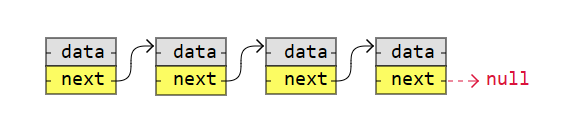
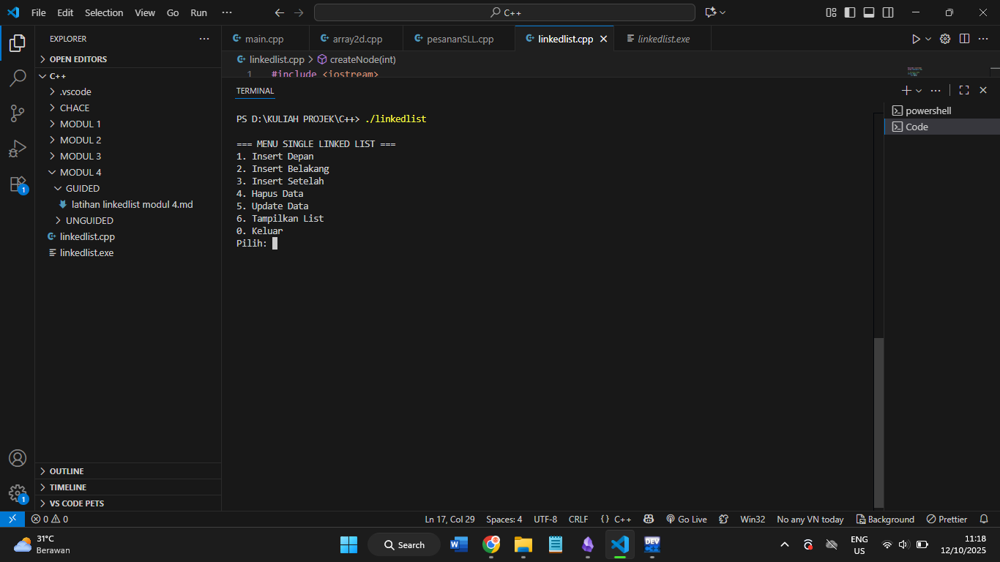
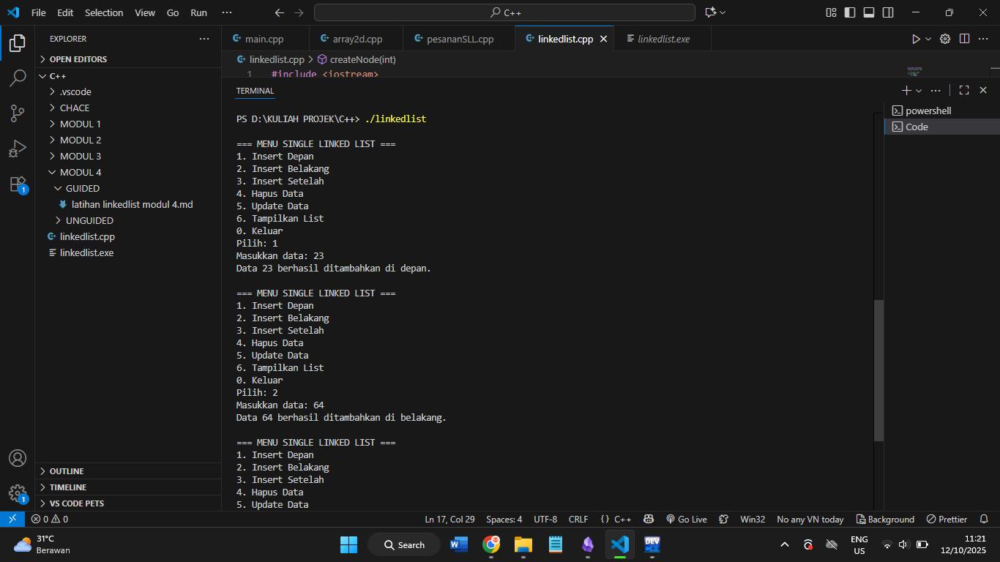
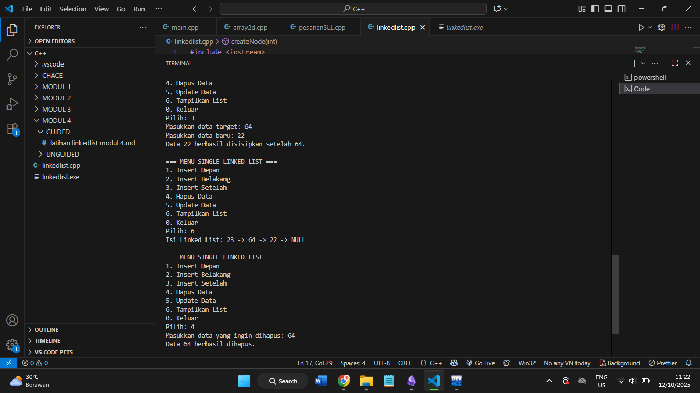
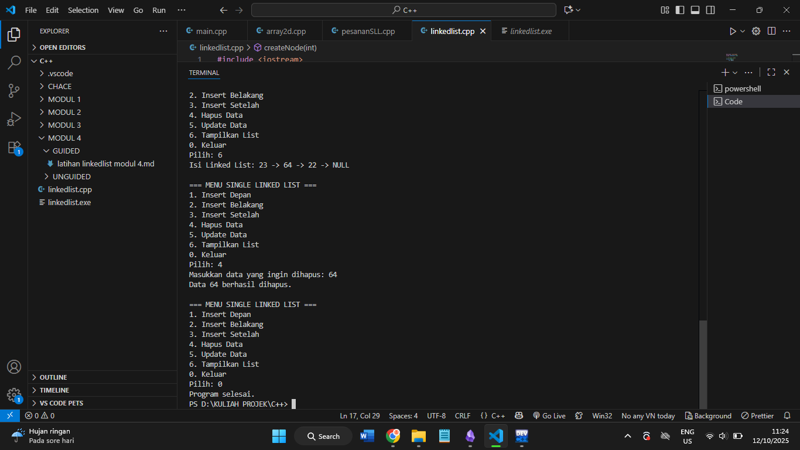
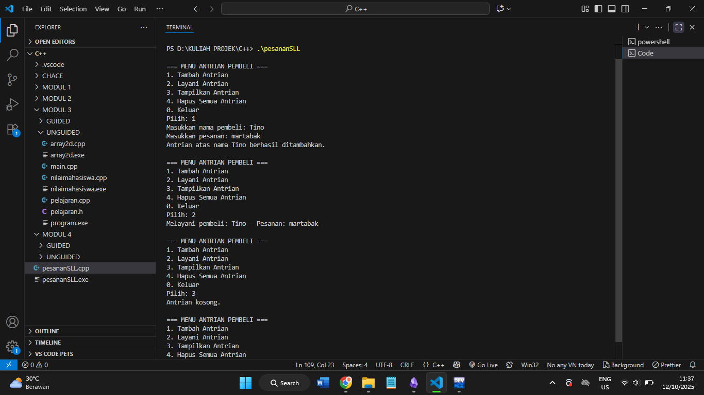
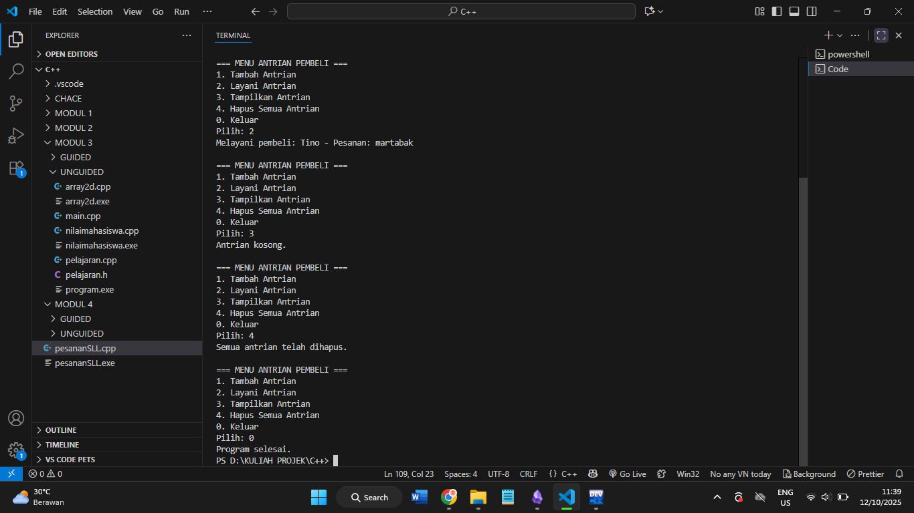
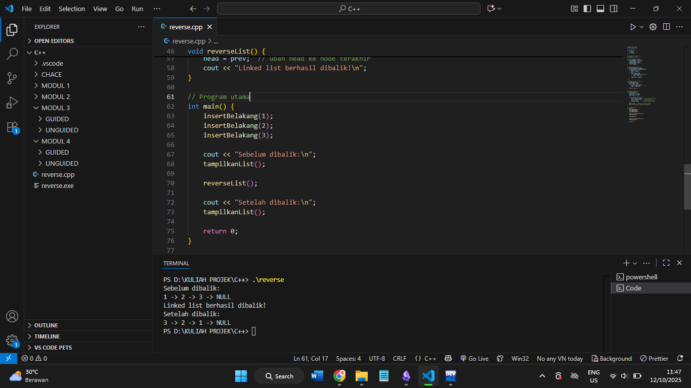

# Laporan Praktikum Stuktur Data MODUL 4 x Singly Linked List


Nama : Rifa Cahya Ariby 

NIM : 103112400268

Kelas : S1 IF12 07


---

## Dasar Teori

## Singly Linked List

Struktur data yang digunakan untuk menyimpan sekumpulan data secara berurutan, tetapi tidak harus tersimpan di lokasi memori yang bersebelahan.
Dalam C++, linked list (daftar berantai) adalah struktur data linear yang memungkinkan pengguna untuk menyimpan data di lokasi memori yang tidak bersebelahan (non-contiguous).
Linkedlist terdiri atas simpul-simpul dengan beberapa jenis data, dan sebuah pointer ke simpul berikutnya.
1. **Data**  = nilai yang ingin disimpan.
2. **Pointer (penunjuk)** = alamat node berikutnya (atau sebelumnya, tergantung jenisnya).

  
*Gambar 1. web3school*

Simpul pertama dari linked list disebut sebagai **head** atau simpul kepala. Apabila linked list berisi elemen kosong, maka nilai pointer dari head menunjuk ke NULL. Begitu juga untuk pointer berikutnya dari simpul terakhir atau simpul ekor akan menunjuk ke NULL.
Keuntungan besar menggunakan linked list adalah node disimpan di mana pun terdapat ruang kosong di memori, sehingga node-node tersebut tidak perlu disimpan secara berurutan seperti elemen yang disimpan dalam array. Keunggulan lain dari linked list adalah ketika menambahkan atau menghapus node, node-node lainnya dalam list tidak perlu digeser.
Ukuran elemen dari linked list dapat bertambah secara dinamis dan mudah untuk menyisipkan dan menghapus elemen karena tidak seperti array, kita hanya perlu mengubah pointer elemen sebelumnya dan elemen berikutnya untuk menyisipkan atau menghapus elemen.

## Perbedaan Linkedlist vs Array

Cara termudah untuk memahami linkedlist mungkin dengan membandingkan dengan array.
Linkedlist terdiri dari simpul-simpul, dan merupakan struktur data linear yang kita buat sendiri, tidak seperti array yang merupakan struktur data yang sudah ada dalam bahasa pemrograman yang dapat kita gunakan.
Node di dalam likedlist menyimpan tautan ke node lain, tetapi elemen array tidak perlu menyimpan tautan ke elemen lain.

| Deskripsi                                                                                              | Array | Linked List |
| ------------------------------------------------------------------------------------------------------ | ----- | ----------- |
| Struktur data yang sudah ada dalam bahasa pemrograman                                                  | Ya    | Tidak       |
| Ukuran tetap di memori                                                                                 | Ya    | Tidak       |
| Elemen atau node disimpan berurutan dalam memori (kontigu)                                             | Ya    | Tidak       |
| Penggunaan memori rendah (setiap node hanya berisi data, tidak ada link ke node lain)                  | Ya    | Tidak       |
| Elemen atau node dapat diakses langsung (akses acak)                                                   | Ya    | Tidak       |
| Elemen atau node dapat disisipkan atau dihapus dalam waktu konstan tanpa operasi penggeseran di memori | Tidak | Ya          |

### Keuntungan dan Kerugian Linked List

| **Keuntungan**                                                                                     | **Kerugian**                                                                              |
| -------------------------------------------------------------------------------------------------- | ----------------------------------------------------------------------------------------- |
| Memiliki ukuran **dinamis**, sehingga tidak terbatas seperti array.                                | Membutuhkan **memori tambahan** untuk menyimpan pointer di setiap node.                   |
| Proses **penyisipan dan penghapusan** data di awal atau akhir lebih efisien.                       | Tidak mendukung **akses langsung (random access)** — data harus ditelusuri satu per satu. |
| Dapat digunakan untuk membangun **struktur data kompleks** seperti *stack*, *queue*, atau *graph*. | Kurang **efisien terhadap cache**, karena data tidak tersimpan bersebelahan di memori.    |


## Guided

## Contoh 1

``` cpp
#include <iostream>

using namespace std;

  

// Struktur Node

struct Node {

    int data;

    Node* next;

};

  

// Pointer awal

Node* head = nullptr;

  

// Fungsi untuk membuat node baru

Node* createNode(int data) {

    Node* newNode = new Node();

    newNode->data = data;

    newNode->next = nullptr;

    return newNode;

}

  

// ========== INSERT DEPAN ==========

void insertDepan(int data) {

    Node* newNode = createNode(data);

    newNode->next = head;

    head = newNode;

    cout << "Data " << data << " berhasil ditambahkan di depan.\n";

}

  

// ========== INSERT BELAKANG ==========

void insertBelakang(int data) {

    Node* newNode = createNode(data);

    if (head == nullptr) {

        head = newNode;

    } else {

        Node* temp = head;

        while (temp->next != nullptr) {

            temp = temp->next;

        }

        temp->next = newNode;

    }

    cout << "Data " << data << " berhasil ditambahkan di belakang.\n";

}

  

// ========== INSERT SETELAH ==========

void insertSetelah(int target, int dataBaru) {

    Node* temp = head;

    while (temp != nullptr && temp->data != target) {

        temp = temp->next;

    }

  

    if (temp == nullptr) {

        cout << "Data " << target << " tidak ditemukan!\n";

    } else {

        Node* newNode = createNode(dataBaru);

        newNode->next = temp->next;

        temp->next = newNode;

        cout << "Data " << dataBaru << " berhasil disisipkan setelah " << target << ".\n";

    }

}

  

// ========== DELETE FUNCTION ==========

void hapusNode(int data) {

    if (head == nullptr) {

        cout << "List kosong!\n";

        return;

    }

  

    Node* temp = head;

    Node* prev = nullptr;

  

    // Jika data di node pertama

    if (temp != nullptr && temp->data == data) {

        head = temp->next;

        delete temp;

        cout << "Data " << data << " berhasil dihapus.\n";

        return;

    }

  

    // Cari node yang akan dihapus

    while (temp != nullptr && temp->data != data) {

        prev = temp;

        temp = temp->next;

    }

  

    // Jika data tidak ditemukan

    if (temp == nullptr) {

        cout << "Data " << data << " tidak ditemukan!\n";

        return;

    }

  

    prev->next = temp->next;

    delete temp;

    cout << "Data " << data << " berhasil dihapus.\n";

}

  

// ========== UPDATE FUNCTION ==========

void updateNode(int dataLama, int dataBaru) {

    Node* temp = head;

    while (temp != nullptr && temp->data != dataLama) {

        temp = temp->next;

    }

  

    if (temp == nullptr) {

        cout << "Data " << dataLama << " tidak ditemukan!\n";

    } else {

        temp->data = dataBaru;

        cout << "Data " << dataLama << " berhasil diupdate menjadi " << dataBaru << ".\n";

    }

}

  

// ========== DISPLAY FUNCTION ==========

void tampilkanList() {

    if (head == nullptr) {

        cout << "List kosong!\n";

        return;

    }

  

    Node* temp = head;

    cout << "Isi Linked List: ";

    while (temp != nullptr) {

        cout << temp->data << " -> ";

        temp = temp->next; // ✅ titik koma sudah ditambah

    }

    cout << "NULL\n";

}

  

// ========== MAIN PROGRAM ==========

int main() {

    int pilihan, data, target, dataBaru;

  

    do {

        cout << "\n=== MENU SINGLE LINKED LIST ===\n";

        cout << "1. Insert Depan\n";

        cout << "2. Insert Belakang\n";

        cout << "3. Insert Setelah\n";

        cout << "4. Hapus Data\n";

        cout << "5. Update Data\n";

        cout << "6. Tampilkan List\n";

        cout << "0. Keluar\n";

        cout << "Pilih: ";

        cin >> pilihan;

  

        switch (pilihan) {

            case 1:

                cout << "Masukkan data: ";

                cin >> data;

                insertDepan(data);

                break;

            case 2:

                cout << "Masukkan data: ";

                cin >> data;

                insertBelakang(data);

                break;

            case 3:

                cout << "Masukkan data target: ";

                cin >> target;

                cout << "Masukkan data baru: ";

                cin >> dataBaru;

                insertSetelah(target, dataBaru);

                break;

            case 4:

                cout << "Masukkan data yang ingin dihapus: ";

                cin >> data;

                hapusNode(data);

                break;

            case 5:

                cout << "Masukkan data lama: ";

                cin >> data;

                cout << "Masukkan data baru: ";

                cin >> dataBaru;

                updateNode(data, dataBaru);

                break;

            case 6:

                tampilkanList();

                break;

            case 0:

                cout << "Program selesai.\n";

                break;

            default:

                cout << "Pilihan tidak valid!\n";

        }

    } while (pilihan != 0);

  

    return 0;

}
```

### Output









> Program di atas adalah implementasi **Single Linked List** dalam bahasa C++. Struktur `Node` berisi data dan pointer ke node berikutnya. Pointer `head` digunakan untuk menandai awal dari linked list. Program ini memiliki beberapa fungsi utama: `insertDepan` untuk menambah data di awal list, `insertBelakang` untuk menambah di akhir, dan `insertSetelah` untuk menambah setelah data tertentu. Fungsi `hapusNode` digunakan untuk menghapus data tertentu dari list, `updateNode` untuk mengganti nilai data lama menjadi baru, dan `tampilkanList` untuk menampilkan seluruh isi list secara berurutan hingga akhir (NULL). Di dalam fungsi `main`, terdapat menu interaktif yang memungkinkan pengguna memilih operasi yang ingin dilakukan sampai memilih keluar dari program.


## Unguided


### Soal 1
Buatlah single linked list untuk Antrian yang menyimpan data pembeli( nama dan pesanan). program memiliki beberapa menu seperti tambah antrian,  layani antrian(hapus), dan tampilkan antrian. \*antrian pertama harus yang pertama dilayani

``` cpp
#include <iostream>

#include <string>

using namespace std;

  

// Struktur Node untuk menyimpan data pembeli

struct Node {

    string nama;

    string pesanan;

    Node* next;

};

  

// Pointer head (awal antrian)

Node* head = nullptr;

  

// Fungsi membuat node baru

Node* createNode(string nama, string pesanan) {

    Node* newNode = new Node();

    newNode->nama = nama;

    newNode->pesanan = pesanan;

    newNode->next = nullptr;

    return newNode;

}

  

// ========== TAMBAH ANTRIAN ==========

void tambahAntrian(string nama, string pesanan) {

    Node* newNode = createNode(nama, pesanan);

  

    if (head == nullptr) {

        head = newNode;

    } else {

        Node* temp = head;

        while (temp->next != nullptr) {

            temp = temp->next;

        }

        temp->next = newNode;

    }

    cout << "Antrian atas nama " << nama << " berhasil ditambahkan.\n";

}

  

// ========== LAYANI ANTRIAN (hapus dari depan) ==========

void layaniAntrian() {

    if (head == nullptr) {

        cout << "Tidak ada antrian untuk dilayani.\n";

        return;

    }

  

    Node* temp = head;

    cout << "Melayani pembeli: " << temp->nama << " - Pesanan: " << temp->pesanan << endl;

    head = head->next;

    delete temp;

}

  

// ========== TAMPILKAN ANTRIAN ==========

void tampilkanAntrian() {

    if (head == nullptr) {

        cout << "Antrian kosong.\n";

        return;

    }

  

    Node* temp = head;

    cout << "\n=== Daftar Antrian Pembeli ===\n";

    while (temp != nullptr) {

        cout << "Nama: " << temp->nama << " | Pesanan: " << temp->pesanan << endl;

        temp = temp->next;

    }

    cout << "==============================\n";

}

  

// ========== HAPUS SEMUA ANTRIAN ==========

void hapusSemua() {

    Node* temp;

    while (head != nullptr) {

        temp = head;

        head = head->next;

        delete temp;

    }

    cout << "Semua antrian telah dihapus.\n";

}

  

// ========== MAIN PROGRAM ==========

int main() {

    int pilihan;

    string nama, pesanan;

  

    do {

        cout << "\n=== MENU ANTRIAN PEMBELI ===\n";

        cout << "1. Tambah Antrian\n";

        cout << "2. Layani Antrian\n";

        cout << "3. Tampilkan Antrian\n";

        cout << "4. Hapus Semua Antrian\n";

        cout << "0. Keluar\n";

        cout << "Pilih: ";

        cin >> pilihan;

        cin.ignore(); // menghapus newline di buffer

  

        switch (pilihan) {

            case 1:

                cout << "Masukkan nama pembeli: ";

                getline(cin, nama);

                cout << "Masukkan pesanan: ";

                getline(cin, pesanan);

                tambahAntrian(nama, pesanan);

                break;

            case 2:

                layaniAntrian();

                break;

            case 3:

                tampilkanAntrian();

                break;

            case 4:

                hapusSemua();

                break;

            case 0:

                cout << "Program selesai.\n";

                break;

            default:

                cout << "Pilihan tidak valid!\n";

        }

    } while (pilihan != 0);

  

    return 0;

}
```


### Output




> Program di atas membuat **sistem antrian pembeli** menggunakan **struktur data Single Linked List** dalam bahasa C++.  
> Struktur `Node` berfungsi menyimpan **nama pembeli** dan **pesanan**, serta pointer `next` untuk menunjuk ke pembeli berikutnya dalam antrian.  
> Pointer global `head` digunakan sebagai penanda **awal antrian**.
> Ketika pengguna memilih menu **Tambah Antrian**, program membuat node baru melalui fungsi `createNode()` dan menambahkannya ke **akhir antrian**, sehingga pembeli yang datang duluan akan dilayani lebih dulu.  
> Fungsi **Layani Antrian** akan menghapus node paling depan (pembeli pertama), menampilkan siapa yang sedang dilayani, lalu memindahkan `head` ke antrian berikutnya.  
> Fungsi **Tampilkan Antrian** mencetak semua data pembeli yang masih menunggu, sedangkan **Hapus Semua Antrian** membersihkan seluruh node dari memori.
> Di dalam fungsi `main()`, program berjalan dalam bentuk menu interaktif di mana pengguna dapat memilih aksi dengan memasukkan angka.  
> Perulangan `do-while` memastikan menu akan terus tampil sampai pengguna memilih **keluar (0)**.


### Soal 2

Buatlah program kode untuk membalik (reverse) singly linked list (1-2-3 menjadi 3-2-1)


``` cpp
#include <iostream>

using namespace std;

  

// Struktur Node

struct Node {

    int data;

    Node* next;

};

  

// Pointer awal linked list

Node* head = nullptr;

  

// Fungsi membuat node baru

Node* createNode(int data) {

    Node* newNode = new Node();

    newNode->data = data;

    newNode->next = nullptr;

    return newNode;

}

  

// Menambah node di akhir

void insertBelakang(int data) {

    Node* newNode = createNode(data);

    if (head == nullptr) {

        head = newNode;

    } else {

        Node* temp = head;

        while (temp->next != nullptr) {

            temp = temp->next;

        }

        temp->next = newNode;

    }

}

  

// Menampilkan isi linked list

void tampilkanList() {

    Node* temp = head;

    while (temp != nullptr) {

        cout << temp->data << " -> ";

        temp = temp->next;

    }

    cout << "NULL\n";

}

  

// Membalik linked list

void reverseList() {

    Node* prev = nullptr;

    Node* current = head;

    Node* next = nullptr;

  

    while (current != nullptr) {

        next = current->next;  // simpan node berikutnya

        current->next = prev;  // ubah arah panah

        prev = current;        // geser prev ke current

        current = next;        // geser current ke next

    }

    head = prev;  // ubah head ke node terakhir

    cout << "Linked list berhasil dibalik!\n";

}

  

// Program utama

int main() {

    insertBelakang(1);

    insertBelakang(2);

    insertBelakang(3);

  

    cout << "Sebelum dibalik:\n";

    tampilkanList();

  

    reverseList();

  

    cout << "Setelah dibalik:\n";

    tampilkanList();

  

    return 0;

}
```

### Output




> Program ini membuat linked list `1 -> 2 -> 3 -> NULL`.  
> Fungsi `reverseList()` menggunakan tiga pointer (`prev`, `current`, `next`) untuk membalik arah hubungan antar-node.  
> Setelah proses selesai, `head` menunjuk ke node terakhir sehingga urutannya menjadi `3 -> 2 -> 1 -> NULL`.


## Referensi

1. Modul Praktikum
2. https://www.w3schools.com/dsa/dsa_theory_linkedlists.php
3. https://www.geeksforgeeks.org/cpp/cpp-linked-list/
4. https://www.geeksforgeeks.org/dsa/singly-linked-list-tutorial/
5. https://www.trivusi.web.id/2022/07/struktur-data-linked-list.html


