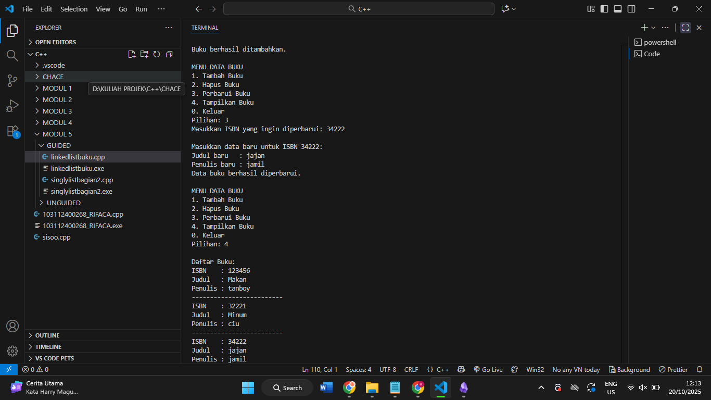
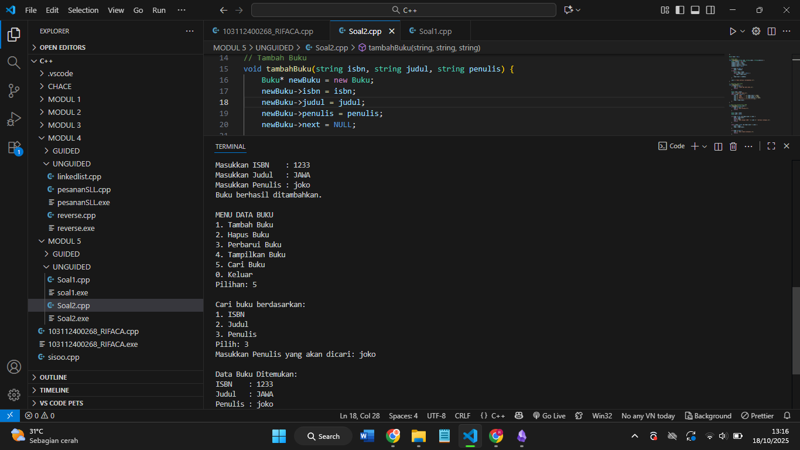

# Laporan Praktikum Stuktur Data MODUL 5 x Singly Linked List Bagian 2


Nama : Rifa Cahya Ariby 

NIM : 103112400268

Kelas : S1 IF12 07

---

## Dasar Teori

### Searching
Searching (Pencarian Elemen List) merupakan algoritma pencarian data yang ditujukan untuk menerima sebuah argumen kunci beserta alamatnya. Pencarian dilakukan ketika diberikan sebuah list target dan sebuah kuncipencarian. Pencarian dimulai dari elemen pertama dan dilakukan sampai datayang dicari ditemukan, atau sampai data dalam list sudah habis diperiksa.


Keuntungan menggunakan searching pada program linked list adalah:
1. Memungkinkan pencarian data secara dinamis dalam list yang ukurannya bisa bertambah atau berkurang tanpa batas tertentu. Linked list tidak membutuhkan ukuran tetap, sehingga searching bisa dilakukan kapan saja untuk data yang terus berubah.
2. Memberikan kemampuan untuk menemukan posisi atau keberadaan data tertentu dalam list yang elemen-elemennya tersebar secara dinamis di memori. Fungsi searching membantu mengakses data walaupun node-node tidak tersimpan secara berurutan seperti array.
3. Mendukung operasi umum linked list seperti update atau hapus data yang diawali dengan pencarian elemen yang terkait. Tanpa searching, operasi lain seperti update atau delete tidak bisa dilakukan secara tepat.
Namun, searching di linked list memiliki kinerja yang relatif lambat karena harus menelusuri node satu per satu dari awal hingga data ditemukan atau list habis. Ini berbeda dengan array yang mengizinkan akses langsung indeks.

## Guided

### Linked list1
``` cpp
#include <iostream>

using namespace std;

  

// Struktur Node

struct Node {

    int data;

    Node* next;

};

Node* head = nullptr;

  

// Fungsi untuk membuat node baru

Node* createNode(int data) {

    Node* newNode = new Node();

    newNode->data = data;

    newNode->next = nullptr;

    return newNode;

}

  

// ========== INSERT DEPAN FUNCTION (Penambahan) ==========

void insertDepan(int data) {

    Node* newNode = createNode(data);

    // Logika Insert First: Node baru menunjuk ke head lama, lalu head menunjuk ke Node baru.

    newNode->next = head;

    head = newNode;

    cout << "Data " << data << " berhasil ditambahkan di depan.\n";

}

  

// ========== INSERT BELAKANG FUNCTION ==========

void insertBelakang(int data) {

    Node* newNode = createNode(data);

    if (head == nullptr) {

        head = newNode;

    } else {

        Node* temp = head;

        while (temp->next != nullptr) {

            temp = temp->next;

        }

        temp->next = newNode;

    }

    cout << "Data " << data << " berhasil ditambahkan di belakang.\n";

}

  

// ========== INSERT SETELAH FUNCTION ==========

void insertSetelah(int target, int dataBaru) {

    Node* temp = head;

    while (temp != nullptr && temp->data != target) {

        temp = temp->next;

    }

    if (temp == nullptr) {

        cout << "Data " << target << " tidak ditemukan!\n";

    } else {

        Node* newNode = createNode(dataBaru);

        // Logika Insert After: Sambungkan newNode ke temp->next, lalu temp ke newNode

        newNode->next = temp->next;

        temp->next = newNode;

        cout << "Data " << dataBaru << " berhasil disisipkan setelah " << target << ".\n";

    }

}

  

// ========== DELETE FUNCTION ==========

void hapusNode(int data) {

    if (head == nullptr) {

        cout << "List kosong!\n";

        return;

    }

  

    Node* temp = head;

    Node* prev = nullptr;

  

    // Jika data di node pertama (Delete First)

    if (temp != nullptr && temp->data == data) {

        head = temp->next;

        delete temp;

        cout << "Data " << data << " berhasil dihapus.\n";

        return;

    }

  

    // Cari node yang akan dihapus

    while (temp != nullptr && temp->data != data) {

        prev = temp;

        temp = temp->next;

    }

  

    // Jika data tidak ditemukan

    if (temp == nullptr) {

        cout << "Data " << data << " tidak ditemukan!\n";

        return;

    }

  

    // Putuskan tautan: prev melompati temp

    prev->next = temp->next;

    delete temp;

    cout << "Data " << data << " berhasil dihapus.\n";

}

  

// ========== UPDATE FUNCTION ==========

void updateNode(int dataLama, int dataBaru) {

    Node* temp = head;

    while (temp != nullptr && temp->data != dataLama) {

        temp = temp->next;

    }

    if (temp == nullptr) {

        cout << "Data " << dataLama << " tidak ditemukan!\n";

    } else {

        temp->data = dataBaru;

        cout << "Data " << dataLama << " berhasil diupdate menjadi " << dataBaru << ".\n";

    }

}

  

// ========== SEARCH FUNCTION ==========

void searchData(int key) {

    Node* temp = head;

    int pos = 1;

    bool found = false;

    while (temp != nullptr) {

        if (temp->data == key) {

            cout << "Data " << key << " ditemukan pada posisi ke-" << pos << endl;

            found = true;

            break;

        }

        temp = temp->next;

        pos++;

    }

  

    if (!found) {

        cout << "Data " << key << " tidak ditemukan dalam linked list.\n";

    }

}

  

// ========== DISPLAY FUNCTION ==========

void tampilkanList() {

    if (head == nullptr) {

        cout << "List kosong!\n";

        return;

    }

  

    Node* temp = head;

    cout << "Isi Linked List: ";

    while (temp != nullptr) {

        cout << temp->data << " -> ";

        temp = temp->next;

    }

    cout << "NULL\n";

}

  

// ========== MAIN PROGRAM ==========

int main() {

    int pilihan, data, target, dataBaru;

    do {

        cout << "\n=== MENU SINGLE LINKED LIST ===\n";

        cout << "1. Insert Depan\n";

        cout << "2. Insert Belakang\n";

        cout << "3. Insert Setelah\n";

        cout << "4. Hapus Data\n";

        cout << "5. Update Data\n";

        cout << "6. Tampilkan List\n";

        cout << "7. Cari Data\n";

        cout << "0. Keluar\n";

        cout << "Pilih: ";

  

        if (!(cin >> pilihan)) {

            cin.clear();

            cin.ignore(10000, '\n');

            pilihan = -1;

        }

  

        switch (pilihan) {

            case 1:

                cout << "Masukkan data: ";

                cin >> data;

                insertDepan(data);

                break;

            case 2:

                cout << "Masukkan data: ";

                cin >> data;

                insertBelakang(data);

                break;

            case 3:

                cout << "Masukkan data target: ";

                cin >> target;

                cout << "Masukkan data baru: ";

                cin >> dataBaru;

                insertSetelah(target, dataBaru);

                break;

            case 4:

                cout << "Masukkan data yang ingin dihapus: ";

                cin >> data;

                hapusNode(data);

                break;

            case 5:

                cout << "Masukkan data lama: ";

                cin >> data;

                cout << "Masukkan data baru: ";

                cin >> dataBaru;

                updateNode(data, dataBaru);

                break;

            case 6:

                tampilkanList();

                break;

            case 7:

                cout << "Masukkan data yang dicari (key): ";

                cin >> data;

                searchData(data);

                break;

            case 0:

                cout << "Program selesai.\n";

                break;

            default:

                cout << "Pilihan tidak valid!\n";

        }

    } while (pilihan != 0);

  

    return 0;

}
```

### Output


> Kode ini mengimplementasikan **single linked list** dalam bahasa C++. Berikut poin-poin pentingnya:
> - **Node** adalah struktur dengan dua bagian: data (integer) dan pointer ke node berikutnya.
> - Ada pointer global **head** untuk menandai awal list.     
> - Fungsi **createNode** membuat node baru dengan nilai data tertentu.    
> - Fungsi **insertDepan** menambah node baru di awal list, sehingga node baru menjadi head.>     
> - Fungsi **insertBelakang** menambah node di akhir list dengan cara menelusuri sampai node terakhir lalu menambah node baru di sana.     
> - Fungsi **insertSetelah** menyisipkan node baru setelah node yang berisi data target jika ditemukan.>     
> - Fungsi **hapusNode** menghapus node yang berisi data tertentu, menangani kasus saat node di awal atau node lain.     
> - Fungsi **updateNode** mengganti nilai data node yang lama dengan data baru jika ditemukan.     
> - Fungsi **searchData** mencari data tertentu dan melaporkan posisinya dalam list.     
> - Fungsi **tampilkanList** menampilkan isi lengkap linked list dari awal hingga akhir.     
> - Program utama menyediakan menu interaktif untuk memilih operasi-operasi tersebut secara berulang sampai memilih keluar.


### Linkedlist buku


``` cpp
#include <iostream>

#include <string>

using namespace std;

  

struct Buku {

    string isbn;

    string judul;

    string penulis;

    Buku* next;

};

  

Buku* head = NULL;

  

// Tambah Buku

void tambahBuku(string isbn, string judul, string penulis) {

    Buku* newBuku = new Buku;

    newBuku->isbn = isbn;

    newBuku->judul = judul;

    newBuku->penulis = penulis;

    newBuku->next = NULL;

  

    if (head == NULL) {

        head = newBuku;

    } else {

        Buku* temp = head;

        while (temp->next != NULL) {

            temp = temp->next;

        }

        temp->next = newBuku;

    }

  

    cout << "Buku berhasil ditambahkan.\n";

}

  

// Tampilkan Semua Buku

void tampilBuku() {

    if (head == NULL) {

        cout << "Tidak ada data buku.\n";

        return;

    }

  

    Buku* temp = head;

    cout << "\nDaftar Buku:\n";

    while (temp != NULL) {

        cout << "ISBN    : " << temp->isbn << endl;

        cout << "Judul   : " << temp->judul << endl;

        cout << "Penulis : " << temp->penulis << endl;

        cout << "-------------------------\n";

        temp = temp->next;

    }

}

  

// Hapus Buku Berdasarkan ISBN

void hapusBuku(string isbn) {

    if (head == NULL) {

        cout << "Data kosong.\n";

        return;

    }

  

    Buku* temp = head;

    Buku* prev = NULL;

  

    if (temp != NULL && temp->isbn == isbn) {

        head = temp->next;

        delete temp;

        cout << "Buku dengan ISBN " << isbn << " berhasil dihapus.\n";

        return;

    }

  

    while (temp != NULL && temp->isbn != isbn) {

        prev = temp;

        temp = temp->next;

    }

  

    if (temp == NULL) {

        cout << "Buku tidak ditemukan.\n";

        return;

    }

  

    prev->next = temp->next;

    delete temp;

    cout << "Buku dengan ISBN " << isbn << " berhasil dihapus.\n";

}

  

// Update Buku

void updateBuku(string isbn) {

    if (head == NULL) {

        cout << "Tidak ada data buku.\n";

        return;

    }

  

    Buku* temp = head;

    while (temp != NULL && temp->isbn != isbn) {

        temp = temp->next;

    }

  

    if (temp == NULL) {

        cout << "Buku dengan ISBN " << isbn << " tidak ditemukan.\n";

        return;

    }

  

    cout << "\nMasukkan data baru untuk ISBN " << isbn << ":\n";

    cout << "Judul baru   : ";

    getline(cin, temp->judul);

    cout << "Penulis baru : ";

    getline(cin, temp->penulis);

  

    cout << "Data buku berhasil diperbarui.\n";

}

  

// Program Utama

int main() {

    int pilihan;

    string isbn, judul, penulis;

  

    do {

        cout << "\nMENU DATA BUKU\n";

        cout << "1. Tambah Buku\n";

        cout << "2. Hapus Buku\n";

        cout << "3. Perbarui Buku\n";

        cout << "4. Tampilkan Buku\n";

        cout << "0. Keluar\n";

        cout << "Pilihan: ";

        cin >> pilihan;

        cin.ignore();

  

        switch (pilihan) {

            case 1:

                cout << "Masukkan ISBN    : ";

                getline(cin, isbn);

                cout << "Masukkan Judul   : ";

                getline(cin, judul);

                cout << "Masukkan Penulis : ";

                getline(cin, penulis);

                tambahBuku(isbn, judul, penulis);

                break;

            case 2:

                cout << "Masukkan ISBN yang ingin dihapus: ";

                getline(cin, isbn);

                hapusBuku(isbn);

                break;

            case 3:

                cout << "Masukkan ISBN yang ingin diperbarui: ";

                getline(cin, isbn);

                updateBuku(isbn);

                break;

            case 4:

                tampilBuku();

                break;

            case 0:

                cout << "Keluar dari program.\n";

                break;

            default:

                cout << "Pilihan tidak valid.\n";

        }

  

    } while (pilihan != 0);

  

    return 0;

}

```

### Output





> Program ini menggunakan **single linked list** untuk menyimpan data buku. Setiap buku disimpan dalam node yang berisi `isbn`, `judul`, `penulis`, dan pointer `next` untuk menghubungkan ke buku berikutnya. Pointer `head` menjadi penanda buku pertama; jika `head` kosong berarti belum ada data.
> 
> Saat menambah buku, program membuat node baru lalu menambahkannya di akhir daftar. Fitur tampil buku akan menelusuri seluruh node dari awal dan menampilkan data satu per satu. Fitur hapus buku mencari ISBN yang sesuai, kemudian menghapus node tersebut dari daftar. Fitur update memungkinkan pengguna mengganti judul dan penulis berdasarkan ISBN yang dicari.
> 
> Semua fungsi diakses lewat menu utama yang berjalan terus hingga pengguna memilih keluar. Program ini menunjukkan cara kerja **linked list** untuk menyimpan dan mengelola data secara efisien tanpa batasan ukuran.


## Unguided


### Soal 1

1. Buatlah searcing untuk mencari nama pembeli pada unguided sebelumnya

``` cpp
#include <iostream>

#include <string>

using namespace std;

  

struct Node {

    string nama; // ubah dari int ke string

    Node* next;

};

  
  

Node* head = nullptr;

  

// Fungsi untuk membuat node baru

Node* createNode(string nama) {

    Node* newNode = new Node();

    newNode->nama = nama;

    newNode->next = nullptr;

    return newNode;

}

  

void insertDepan(string nama) {

    Node* newNode = createNode(nama);

    newNode->next = head;

    head = newNode;

    cout << "Pembeli " << nama << " berhasil ditambahkan di depan.\n";

}

  
  

void insertBelakang(string nama) {

    Node* newNode = createNode(nama);

    if (head == nullptr) {

        head = newNode;

    } else {

        Node* temp = head;

        while (temp->next != nullptr) {

            temp = temp->next;

        }

        temp->next = newNode;

    }

    cout << "Pembeli " << nama << " berhasil ditambahkan di belakang.\n";

}

  
  

void insertSetelah(string target, string namaBaru) {

    Node* temp = head;

    while (temp != nullptr && temp->nama != target) {

        temp = temp->next;

    }

  

    if (temp == nullptr) {

        cout << "Nama " << target << " tidak ditemukan!\n";

    } else {

        Node* newNode = createNode(namaBaru);

        newNode->next = temp->next;

        temp->next = newNode;

        cout << "Pembeli " << namaBaru << " berhasil disisipkan setelah " << target << ".\n";

    }

}

  
  

void hapusNode(string nama) {

    if (head == nullptr) {

        cout << "List kosong!\n";

        return;

    }

  

    Node* temp = head;

    Node* prev = nullptr;

  

    if (temp != nullptr && temp->nama == nama) {

        head = temp->next;

        delete temp;

        cout << "Pembeli " << nama << " berhasil dihapus.\n";

        return;

    }

  

    while (temp != nullptr && temp->nama != nama) {

        prev = temp;

        temp = temp->next;

    }

  

    if (temp == nullptr) {

        cout << "Nama " << nama << " tidak ditemukan!\n";

        return;

    }

  

    prev->next = temp->next;

    delete temp;

    cout << "Pembeli " << nama << " berhasil dihapus.\n";

}

  

void updateNode(string namaLama, string namaBaru) {

    Node* temp = head;

    while (temp != nullptr && temp->nama != namaLama) {

        temp = temp->next;

    }

  

    if (temp == nullptr) {

        cout << "Nama " << namaLama << " tidak ditemukan!\n";

    } else {

        temp->nama = namaBaru;

        cout << "Nama " << namaLama << " berhasil diupdate menjadi " << namaBaru << ".\n";

    }

}

  

void cariNode(string namaCari) {

    Node* temp = head;

    int posisi = 1;

    bool ditemukan = false;

  

    while (temp != nullptr) {

        if (temp->nama == namaCari) {

            cout << "Pembeli " << namaCari << " ditemukan di posisi ke-" << posisi << ".\n";

            ditemukan = true;

            break;

        }

        temp = temp->next;

        posisi++;

    }

  

    if (!ditemukan) {

        cout << "Pembeli " << namaCari << " tidak ditemukan dalam list.\n";

    }

}

  

void tampilkanList() {

    if (head == nullptr) {

        cout << "List kosong!\n";

        return;

    }

  

    Node* temp = head;

    cout << "Daftar Pembeli: ";

    while (temp != nullptr) {

        cout << temp->nama << " -> ";

        temp = temp->next;

    }

    cout << "NULL\n";

}

  

int main() {

    int pilihan;

    string nama, target, namaBaru;

  

    do {

        cout << "\n MENU DATA PEMBELI \n";

        cout << "1. Tambah Depan\n";

        cout << "2. Tambah Belakang\n";

        cout << "3. Tambah Setelah\n";

        cout << "4. Hapus Pembeli\n";

        cout << "5. Update Nama\n";

        cout << "6. Tampilkan Daftar Pembeli\n";

        cout << "7. Cari Pembeli\n";

        cout << "0. Keluar\n";

        cout << "Pilih: ";

        cin >> pilihan;

  

        switch (pilihan) {

            case 1:

                cout << "Masukkan nama pembeli: ";

                cin >> nama;

                insertDepan(nama);

                break;

            case 2:

                cout << "Masukkan nama pembeli: ";

                cin >> nama;

                insertBelakang(nama);

                break;

            case 3:

                cout << "Masukkan nama target: ";

                cin >> target;

                cout << "Masukkan nama pembeli baru: ";

                cin >> namaBaru;

                insertSetelah(target, namaBaru);

                break;

            case 4:

                cout << "Masukkan nama pembeli yang ingin dihapus: ";

                cin >> nama;

                hapusNode(nama);

                break;

            case 5:

                cout << "Masukkan nama lama: ";

                cin >> nama;

                cout << "Masukkan nama baru: ";

                cin >> namaBaru;

                updateNode(nama, namaBaru);

                break;

            case 6:

                tampilkanList();

                break;

            case 7:

                cout << "Masukkan nama pembeli yang dicari: ";

                cin >> nama;

                cariNode(nama);

                break;

            case 0:

                cout << "Program selesai.\n";

                break;

            default:

                cout << "Pilihan tidak valid!\n";

        }

    } while (pilihan != 0);

  

    return 0;

}
```

### Output

### Soal 2

2. gunakan latihan pada pertemuan minggun ini dan tambahkan searching untuk mencari buku berdasarkan judul, penulis, dan ISBN

``` cpp
#include <iostream>

#include <string>

using namespace std;

  

struct Buku {

    string isbn;

    string judul;

    string penulis;

    Buku* next;

};

  

Buku* head = NULL;

  

// Tambah Buku

void tambahBuku(string isbn, string judul, string penulis) {

    Buku* newBuku = new Buku;

    newBuku->isbn = isbn;

    newBuku->judul = judul;

    newBuku->penulis = penulis;

    newBuku->next = NULL;

  

    if (head == NULL) {

        head = newBuku;

    } else {

        Buku* temp = head;

        while (temp->next != NULL) {

            temp = temp->next;

        }

        temp->next = newBuku;

    }

  

    cout << "Buku berhasil ditambahkan.\n";

}

  

// Tampilkan Semua Buku

void tampilBuku() {

    if (head == NULL) {

        cout << "Tidak ada data buku.\n";

        return;

    }

  

    Buku* temp = head;

    cout << "\nDaftar Buku:\n";

    while (temp != NULL) {

        cout << "ISBN    : " << temp->isbn << endl;

        cout << "Judul   : " << temp->judul << endl;

        cout << "Penulis : " << temp->penulis << endl;

        cout << "-------------------------\n";

        temp = temp->next;

    }

}

  

// Hapus Buku Berdasarkan ISBN

void hapusBuku(string isbn) {

    if (head == NULL) {

        cout << "Data kosong.\n";

        return;

    }

  

    Buku* temp = head;

    Buku* prev = NULL;

  

    if (temp != NULL && temp->isbn == isbn) {

        head = temp->next;

        delete temp;

        cout << "Buku dengan ISBN " << isbn << " berhasil dihapus.\n";

        return;

    }

  

    while (temp != NULL && temp->isbn != isbn) {

        prev = temp;

        temp = temp->next;

    }

  

    if (temp == NULL) {

        cout << "Buku tidak ditemukan.\n";

        return;

    }

  

    prev->next = temp->next;

    delete temp;

    cout << "Buku dengan ISBN " << isbn << " berhasil dihapus.\n";

}

  

// Update Buku

void updateBuku(string isbn) {

    if (head == NULL) {

        cout << "Tidak ada data buku.\n";

        return;

    }

  

    Buku* temp = head;

    while (temp != NULL && temp->isbn != isbn) {

        temp = temp->next;

    }

  

    if (temp == NULL) {

        cout << "Buku dengan ISBN " << isbn << " tidak ditemukan.\n";

        return;

    }

  

    cout << "\nMasukkan data baru untuk ISBN " << isbn << ":\n";

    cout << "Judul baru   : ";

    getline(cin, temp->judul);

    cout << "Penulis baru : ";

    getline(cin, temp->penulis);

  

    cout << "Data buku berhasil diperbarui.\n";

}

  

// Cari Buku Berdasarkan ISBN / Judul / Penulis

void cariBuku() {

    if (head == NULL) {

        cout << "Tidak ada data buku.\n";

        return;

    }

  

    int pilihan;

    string cari;

    cout << "\nCari buku berdasarkan:\n";

    cout << "1. ISBN\n";

    cout << "2. Judul\n";

    cout << "3. Penulis\n";

    cout << "Pilih: ";

    cin >> pilihan;

    cin.ignore();

  

    if (pilihan == 1) {

        cout << "Masukkan ISBN yang akan dicari: ";

    } else if (pilihan == 2) {

        cout << "Masukkan Judul yang akan dicari: ";

    } else if (pilihan == 3) {

        cout << "Masukkan Penulis yang akan dicari: ";

    } else {

        cout << "Pilihan tidak valid.\n";

        return;

    }

  

    getline(cin, cari);

  

    Buku* temp = head;

    bool ditemukan = false;

  

    while (temp != NULL) {

        if ((pilihan == 1 && temp->isbn == cari) ||

            (pilihan == 2 && temp->judul == cari) ||

            (pilihan == 3 && temp->penulis == cari)) {

            cout << "\nData Buku Ditemukan:\n";

            cout << "ISBN    : " << temp->isbn << endl;

            cout << "Judul   : " << temp->judul << endl;

            cout << "Penulis : " << temp->penulis << endl;

            cout << "-------------------------\n";

            ditemukan = true;

        }

        temp = temp->next;

    }

  

    if (!ditemukan) {

        cout << "Data buku tidak ditemukan.\n";

    }

}

  

// Program Utama

int main() {

    int pilihan;

    string isbn, judul, penulis;

  

    do {

        cout << "\nMENU DATA BUKU\n";

        cout << "1. Tambah Buku\n";

        cout << "2. Hapus Buku\n";

        cout << "3. Perbarui Buku\n";

        cout << "4. Tampilkan Buku\n";

        cout << "5. Cari Buku\n";

        cout << "0. Keluar\n";

        cout << "Pilihan: ";

        cin >> pilihan;

        cin.ignore();

  

        switch (pilihan) {

            case 1:

                cout << "Masukkan ISBN    : ";

                getline(cin, isbn);

                cout << "Masukkan Judul   : ";

                getline(cin, judul);

                cout << "Masukkan Penulis : ";

                getline(cin, penulis);

                tambahBuku(isbn, judul, penulis);

                break;

            case 2:

                cout << "Masukkan ISBN yang ingin dihapus: ";

                getline(cin, isbn);

                hapusBuku(isbn);

                break;

            case 3:

                cout << "Masukkan ISBN yang ingin diperbarui: ";

                getline(cin, isbn);

                updateBuku(isbn);

                break;

            case 4:

                tampilBuku();

                break;

            case 5:

                cariBuku();

                break;

            case 0:

                cout << "Keluar dari program.\n";

                break;

            default:

                cout << "Pilihan tidak valid.\n";

        }

  

    } while (pilihan != 0);

  

    return 0;

}
```

### Output




### Referensi
1. Modul Praktikum
2. https://www.scribd.com/presentation/375486821/Searching-pada-Lingked-List-C
3. https://rumahcoding.co.id/linked-list-pengertian-dan-implementasi-dasar/
4. https://fikti.umsu.ac.id/pengertian-linked-list-struktur-data-dalam-pemrograman/
5. https://www.trivusi.web.id/2022/07/struktur-data-linked-list.html