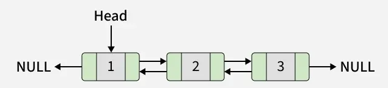
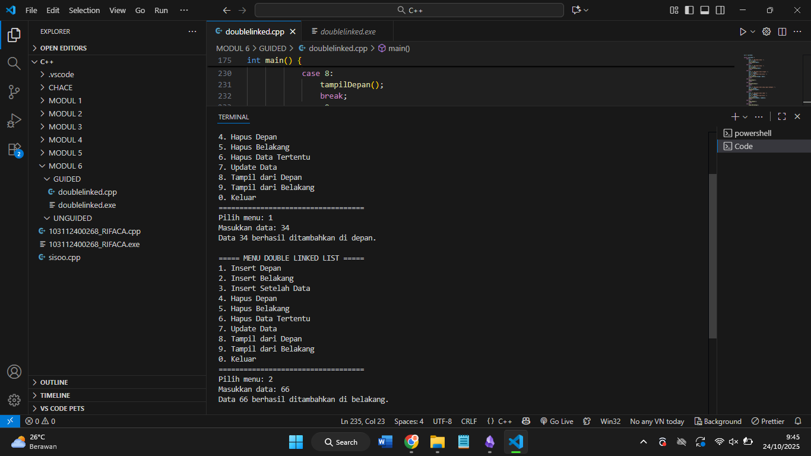
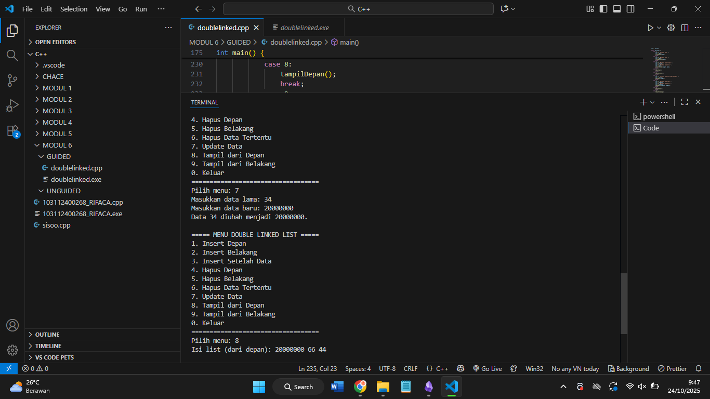
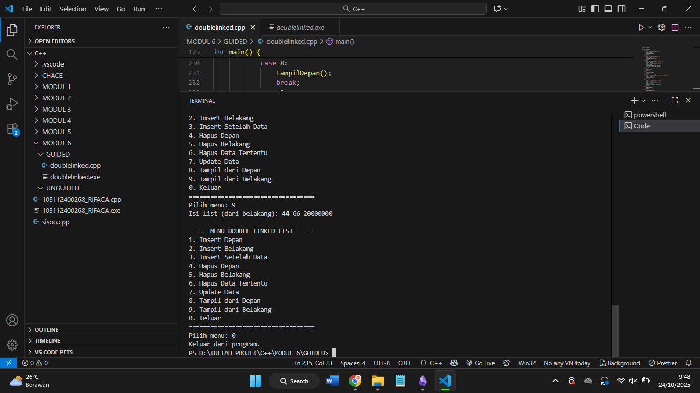
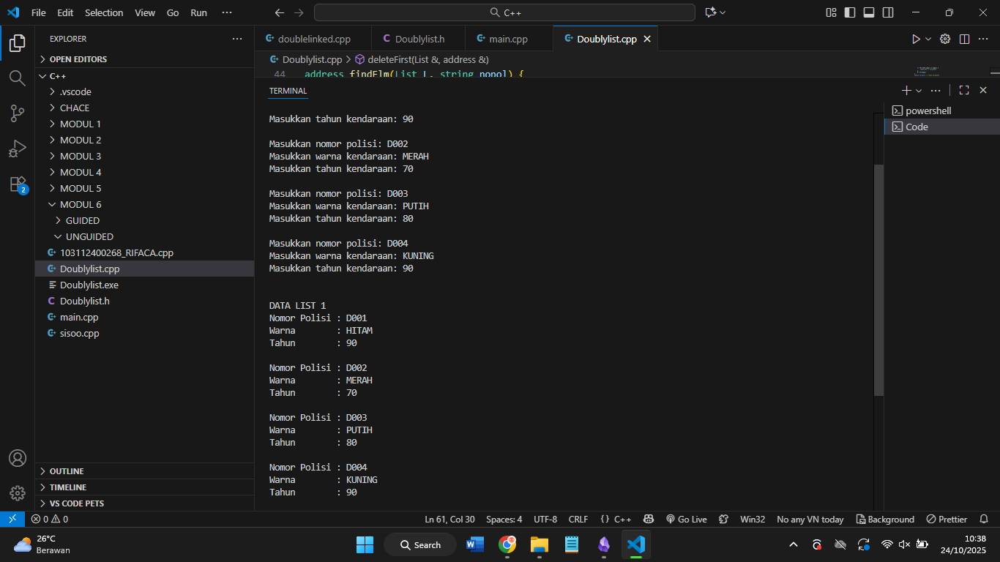
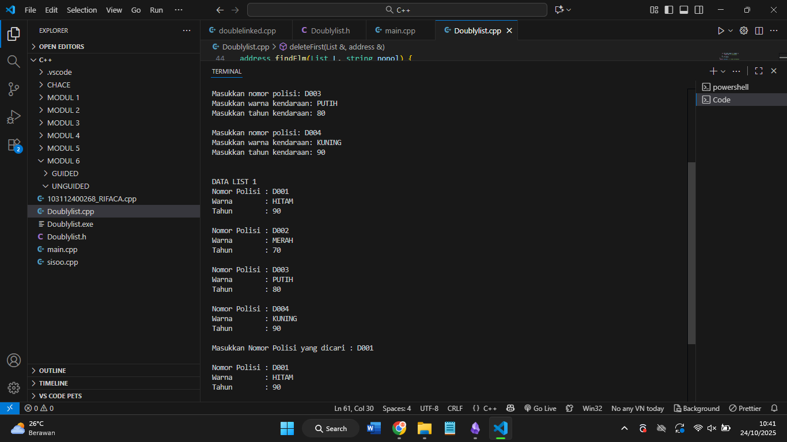
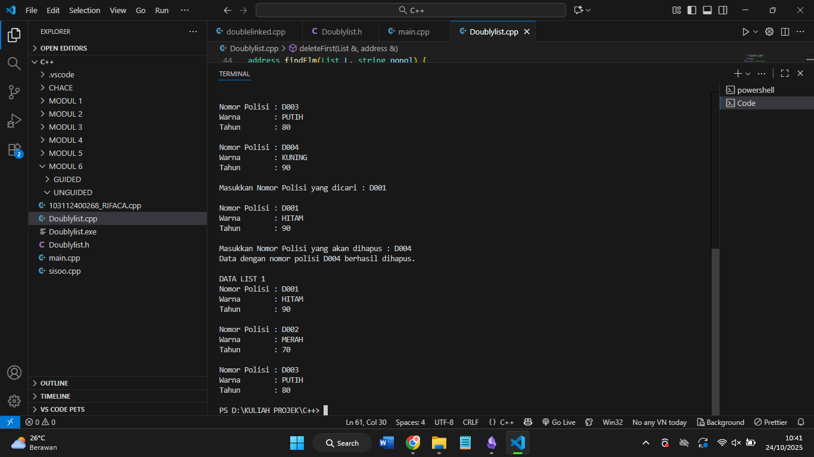

# Laporan Praktikum Stuktur Data MODUL 6 x Doubly Linked List


Nama : Rifa Cahya Ariby 

NIM : 103112400268

Kelas : S1 IF12 07

---

## Dasar Teori

### Doubly Linked List 
Doubly linked list merupakan struktur data yang lebih kompleks daripada singly linked list, tetapi menawarkan beberapa keuntungan. Keuntungan utama dari doubly linked list adalah memungkinkan traversal daftar yang efisien di kedua arah. Hal ini karena setiap simpul dalam daftar berisi penunjuk ke simpul sebelumnya dan penunjuk ke simpul berikutnya. Hal ini memungkinkan penyisipan dan penghapusan simpul dari daftar dengan cepat dan mudah, serta traversal daftar yang efisien di kedua arah.





Representasi Doubly Linked List dalam Struktur Data
Dalam struktur data, Doubly Linked List direpresentasikan menggunakan node yang memiliki tiga bidang:
1. Data
2. Penunjuk ke simpul berikutnya ( next )
3. Penunjuk ke simpul sebelumnya ( prev )


**Singly Linked List VS Doubly Linked List**

| Aspek                         | Singly Linked List     | Doubly Linked List                    |
| ----------------------------- | ---------------------- | ------------------------------------- |
| Pointer per node              | 1 (ke node berikutnya) | 2 (ke node sebelumnya dan berikutnya) |
| Arah traversal                | Satu arah (maju)       | Dua arah (maju dan mundur)            |
| Kompleksitas operasi          | Lebih sederhana        | Lebih kompleks                        |
| Penggunaan memori             | Lebih sedikit          | Lebih banyak                          |
| Efisiensi penghapusan/sisipan | Terbatas di ujung      | Bisa di tengah maupun ujung           |


Selain itu, Doubly Linked List memungkinkan operasi penghapusan dan penyisipan di posisi mana pun dengan lebih efisien daripada Singly Linked List yang biasanya lebih mudah untuk operasi di ujung daftar saja.

## Guided

``` cpp
#include <iostream>

using namespace std;

  

struct Node {

    int data;

    Node* prev;

    Node* next;

};

  

Node* head = NULL;

Node* tail = NULL;

  

void insertDepan(int data) {

    Node* newNode = new Node();

    newNode->data = data;

    newNode->prev = NULL;

    newNode->next = head;

  

    if (head != NULL) {

        head->prev = newNode;

    } else {

        tail = newNode;

    }

    head = newNode;

    cout << "Data " << data << " berhasil ditambahkan di depan.\n";

}

  

void insertBelakang(int data) {

    Node* newNode = new Node();

    newNode->data = data;

    newNode->prev = tail;

    newNode->next = NULL;

  

    if (tail != NULL) {

        tail->next = newNode;

    } else {

        head = newNode;

    }

    tail = newNode;

    cout << "Data " << data << " berhasil ditambahkan di belakang.\n";

}

  

void insertSetelah(int target, int data) {

    Node* current = head;

    while (current != NULL && current->data != target) {

        current = current->next;

    }

  

    if (current == NULL) {

        cout << "Data " << target << " tidak ditemukan!\n";

    } else {

        Node* newNode = new Node();

        newNode->data = data;

        newNode->prev = current;

        newNode->next = current->next;

  

        if (current->next != NULL) {

            current->next->prev = newNode;

        } else {

            tail = newNode;

        }

  

        current->next = newNode;

        cout << "Data " << data << " berhasil disisipkan setelah " << target << ".\n";

    }

}

  

void hapusDepan() {

    if (head == NULL) {

        cout << "List kosong.\n";

        return;

    }

  

    Node* temp = head;

    head = head->next;

  

    if (head != NULL) {

        head->prev = NULL;

    } else {

        tail = NULL;

    }

  

    cout << "Data " << temp->data << " berhasil dihapus dari depan.\n";

    delete temp;

}

  

void hapusBelakang() {

    if (tail == NULL) {

        cout << "List kosong.\n";

        return;

    }

    Node* temp = tail;

    tail = tail->prev;

    if (tail != NULL) {

        tail->next = NULL;

    } else {

        head = NULL;

    }

    cout << "Data " << temp->data << " dihapus dari belakang.\n";

    delete temp;

}

  

void hapusData (int target) {

    if (head == NULL) {

        cout << "List kosong.\n";

        return;

    }

  

    Node* current = head;

    while (current != NULL && current->data != target) {

        current = current->next;

    }

  

    if (current == NULL) {

        cout << "Data " << target << " tidak ditemukan.\n";

        return;

    }

  

    if (current == head) {

        hapusDepan();

    } else if (current == tail) {

        hapusBelakang();

    } else {

        current->prev->next = current->next;

        current->next->prev = current->prev;

        cout << "Data " << target << " dihapus.\n";

        delete current;

    }

}

  

void updateData(int oldData, int newData) {

    Node* current = head;

    while (current != NULL && current->data != oldData)

        current = current->next;

  

    if (current == NULL) {

        cout << "Data " << oldData << " tidak ditemukan.\n";

        return;

    }

  

    current->data = newData;

    cout << "Data " << oldData << " diubah menjadi " << newData << ".\n";

}

  

void tampilDepan() {

    if (head == NULL) {

        cout << "List kosong.\n";

        return;

    }

  

    cout << "Isi list (dari depan): ";

    Node* current = head;

    while (current != NULL) {

        cout << current->data << " ";

        current = current->next;

    }

    cout << "\n";

}

  

void tampilBelakang() {

    if (tail == NULL) {

        cout << "List kosong.\n";

        return;

    }

  

    cout << "Isi list (dari belakang): ";

    Node* current = tail;

    while (current != NULL) {

        cout << current->data << " ";

        current = current->prev;

    }

    cout << "\n";

}

  

int main() {

    int pilihan, data, target, oldData, newData;

  

    do {

        cout << "\n===== MENU DOUBLE LINKED LIST =====\n";

        cout << "1. Insert Depan\n";

        cout << "2. Insert Belakang\n";

        cout << "3. Insert Setelah Data\n";

        cout << "4. Hapus Depan\n";

        cout << "5. Hapus Belakang\n";

        cout << "6. Hapus Data Tertentu\n";

        cout << "7. Update Data\n";

        cout << "8. Tampil dari Depan\n";

        cout << "9. Tampil dari Belakang\n";

        cout << "0. Keluar\n";

        cout << "===================================\n";

        cout << "Pilih menu: ";

        cin >> pilihan;

  

        switch (pilihan) {

            case 1:

                cout << "Masukkan data: ";

                cin >> data;

                insertDepan(data);

                break;

            case 2:

                cout << "Masukkan data: ";

                cin >> data;

                insertBelakang(data);

                break;

            case 3:

                cout << "Masukkan data target: ";

                cin >> target;

                cout << "Masukkan data baru: ";

                cin >> data;

                insertSetelah(target, data);

                break;

            case 4:

                hapusDepan();

                break;

            case 5:

                hapusBelakang();

                break;

            case 6:

                cout << "Masukkan data yang ingin dihapus: ";

                cin >> target;

                hapusData(target);

                break;

            case 7:

                cout << "Masukkan data lama: ";

                cin >> oldData;

                cout << "Masukkan data baru: ";

                cin >> newData;

                updateData(oldData, newData);

                break;

            case 8:

                tampilDepan();

                break;

            case 9:

                tampilBelakang();

                break;

            case 0:

                cout << "Keluar dari program.\n";

                break;

            default:

                cout << "Pilihan tidak valid.\n";

        }

  

    } while (pilihan != 0);

  

    return 0;

}
```
### Output






> Program ini membuat struktur data **Doubly Linked List** untuk menyimpan data bertipe `int`.  
> Setiap elemen disebut **node**, yang punya tiga bagian: nilai data, pointer ke node sebelumnya (`prev`), dan pointer ke node berikutnya (`next`).  
> Variabel global `head` menunjuk ke elemen pertama, sedangkan `tail` menunjuk ke elemen terakhir.
> Program menyediakan berbagai fungsi:  
> `insertDepan()` dan `insertBelakang()` untuk menambah node di awal atau akhir list,  
> `insertSetelah()` untuk menyisipkan data setelah nilai tertentu,  
> `hapusDepan()`, `hapusBelakang()`, dan `hapusData()` untuk menghapus node dari posisi tertentu,  
> serta `updateData()` untuk mengganti isi node.  
> Fungsi `tampilDepan()` dan `tampilBelakang()` menampilkan isi list dari arah depan atau belakang.
> Bagian `main()` berisi menu interaktif yang memungkinkan pengguna memilih operasi yang diinginkan, memasukkan data, dan melihat hasilnya secara langsung.  
> Semua pointer kosong diinisialisasi dengan `NULL` agar mudah dicek apakah list kosong atau tidak.


## Unguided

### Soal 

1. Buatlah ADT Doubly Linked list sebagai berikut di dalam file “Doublylist.h”:
```
Type infotype : kendaraan <
	nopol : string 
	warna : string 
	thnBuat : integer > 

Type address : pointer to ElmList Type ElmList < 
	info : infotype
	next :address 
	prev : address > 
	
Type List < First : address Last : address >
procedure CreateList( input/output L : List ) 
function alokasi( x : infotype ) → address 
procedure dealokasi(input/output P : address ) 
procedure printInfo( input L : List ) 
procedure insertLast(input/output L : List, 
	input P : address ) 
```

Buatlah implementasi ADT Doubly Linked list pada file “Doublylist.cpp” dan coba hasil implementasi ADT pada file “main.cpp”.

2. Carilah elemen dengan nomor polisi D001 dengan membuat fungsi baru. fungsi findElm( L : List, x : infotype ) : address

3. Hapus elemen dengan nomor polisi D003 dengan procedure delete. - procedure deleteFirst( input/output L : List, P : address ) - procedure deleteLast( input/output L : List, P : address ) - procedure deleteAfter( input Prec : address, input/output P : address )
#### Doublylist.h
``` h
#ifndef DOUBLYLIST_H

#define DOUBLYLIST_H

  

#include <iostream>

#include <string>

using namespace std;

  

//-------------------- [1] Struktur Data --------------------

struct kendaraan {

    string nopol;

    string warna;

    int thnBuat;

};

  

typedef kendaraan infotype;

  

struct ElmList {

    infotype info;

    ElmList* next;

    ElmList* prev;

};

  

typedef ElmList* address;

  

struct List {

    address first;

    address last;

};

  

//-------------------- [2] Deklarasi Fungsi --------------------

void createList(List &L);

address alokasi(infotype x);

void dealokasi(address P);

void insertLast(List &L, address P);

void printInfo(List L);

address findElm(List L, string nopol);              // nomor 2

void deleteFirst(List &L, address &P);              // nomor 3

void deleteLast(List &L, address &P);               // nomor 3

void deleteAfter(address Prec, address &P);         // nomor 3

  

#endif
```

#### Doublylist.cpp
``` cpp
#include "Doublylist.h"

  

//-------------------- [1] Membuat list --------------------

void createList(List &L) {

    L.first = nullptr;

    L.last = nullptr;

}

  

address alokasi(infotype x) {

    address P = new ElmList;

    P->info = x;

    P->next = nullptr;

    P->prev = nullptr;

    return P;

}

  

void dealokasi(address P) {

    delete P;

}

  

void insertLast(List &L, address P) {

    if (L.first == nullptr) {

        L.first = P;

        L.last = P;

    } else {

        L.last->next = P;

        P->prev = L.last;

        L.last = P;

    }

}

  

void printInfo(List L) {

    address P = L.first;

    cout << "\nDATA LIST 1\n";

    while (P != nullptr) {

        cout << "Nomor Polisi : " << P->info.nopol << endl;

        cout << "Warna        : " << P->info.warna << endl;

        cout << "Tahun        : " << P->info.thnBuat << endl << endl;

        P = P->next;

    }

}

  

//-------------------- [2] findElm --------------------

address findElm(List L, string nopol) {

    address P = L.first;

    while (P != nullptr) {

        if (P->info.nopol == nopol) {

            return P; // ditemukan

        }

        P = P->next;

    }

    return nullptr; // tidak ditemukan

}

  

//-------------------- [3] Fungsi Hapus --------------------

void deleteFirst(List &L, address &P) {

    if (L.first != nullptr) {

        P = L.first;

        if (L.first == L.last) { // hanya 1 elemen

            L.first = nullptr;

            L.last = nullptr;

        } else {

            L.first = L.first->next;

            L.first->prev = nullptr;

            P->next = nullptr;

        }

    }

}

  

void deleteLast(List &L, address &P) {

    if (L.last != nullptr) {

        P = L.last;

        if (L.first == L.last) { // hanya 1 elemen

            L.first = nullptr;

            L.last = nullptr;

        } else {

            L.last = L.last->prev;

            L.last->next = nullptr;

            P->prev = nullptr;

        }

    }

}

  

void deleteAfter(address Prec, address &P) {

    if (Prec != nullptr && Prec->next != nullptr) {

        P = Prec->next;

        Prec->next = P->next;

        if (P->next != nullptr) {

            P->next->prev = Prec;

        }

        P->next = nullptr;

        P->prev = nullptr;

    }

}
```
#### main.cpp
```cpp
#include "Doublylist.h"

bool cekDuplikat(List L, string nopol) {

    address P = L.first;

    while (P != nullptr) {

        if (P->info.nopol == nopol) {

            return true;

        }

        P = P->next;

    }

    return false;

}

  

int main() {

    List L;

    createList(L);

  

    int n;

    cout << "Masukkan jumlah data kendaraan: ";

    cin >> n;

    cout << endl;

  

    //==================== [1] Input Data ====================

    for (int i = 0; i < n; i++) {

        infotype x;

        cout << "Masukkan nomor polisi: ";

        cin >> x.nopol;

  

        if (cekDuplikat(L, x.nopol)) {

            cout << "Nomor polisi sudah terdaftar\n\n";

            i--;

            continue;

        }

  

        cout << "Masukkan warna kendaraan: ";

        cin >> x.warna;

        cout << "Masukkan tahun kendaraan: ";

        cin >> x.thnBuat;

        cout << endl;

  

        address P = alokasi(x);

        insertLast(L, P);

    }

  

    printInfo(L);

  

    //==================== [2] Cari Nomor Polisi ====================

    string cari;

    cout << "Masukkan Nomor Polisi yang dicari : ";

    cin >> cari;

  

    address found = findElm(L, cari);

    if (found != nullptr) {

        cout << "\nNomor Polisi : " << found->info.nopol << endl;

        cout << "Warna        : " << found->info.warna << endl;

        cout << "Tahun        : " << found->info.thnBuat << endl;

    } else {

        cout << "Data tidak ditemukan.\n";

    }

  

    //==================== [3] Hapus Data ====================

    string hapus;

    cout << "\nMasukkan Nomor Polisi yang akan dihapus : ";

    cin >> hapus;

  

    address del = findElm(L, hapus);

    if (del != nullptr) {

        if (del == L.first) {

            deleteFirst(L, del);

        } else if (del == L.last) {

            deleteLast(L, del);

        } else {

            deleteAfter(del->prev, del);

        }

        dealokasi(del);

        cout << "Data dengan nomor polisi " << hapus << " berhasil dihapus.\n";

    } else {

        cout << "Data tidak ditemukan.\n";

    }

  

    printInfo(L);

    return 0;

}

```
### Output







#### Penjelasan No 1-3

> Pada **nomor 1**, dibuat _ADT Doubly Linked List_ yang menyimpan data kendaraan dengan operasi dasar seperti membuat list, menambah data di akhir (`insertLast`), dan menampilkan seluruh isi list (`printInfo`).
> 
> Selanjutnya **nomor 2** menambahkan fungsi `findElm`, yang digunakan untuk mencari data berdasarkan nomor polisi. Fungsi ini menelusuri setiap elemen dari awal hingga menemukan nomor polisi yang dicari, lalu mengembalikan alamat elemen tersebut jika ditemukan.
> 
> Kemudian **nomor 3** berfokus pada penghapusan data. Ada tiga prosedur: `deleteFirst` untuk menghapus elemen pertama, `deleteLast` untuk elemen terakhir, dan `deleteAfter` untuk menghapus elemen di tengah setelah elemen tertentu. Program utama menentukan posisi elemen yang akan dihapus dengan `findElm`, lalu memanggil prosedur penghapusan yang sesuai.
> 
> Setelah dihapus, data list ditampilkan kembali agar pengguna dapat melihat hasil perubahan secara langsung.

## Referensi
1. Modul Praktikum
2. https://www.geeksforgeeks.org/dsa/doubly-linked-list/
3. https://rumahcoding.co.id/linked-list-pengertian-dan-implementasi-dasar/
4. https://stanleydaveteherag.blogspot.com/2020/03/single-link-list-dan-double-link-list.html
