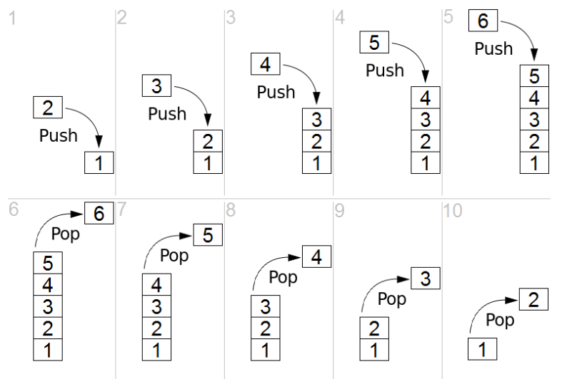
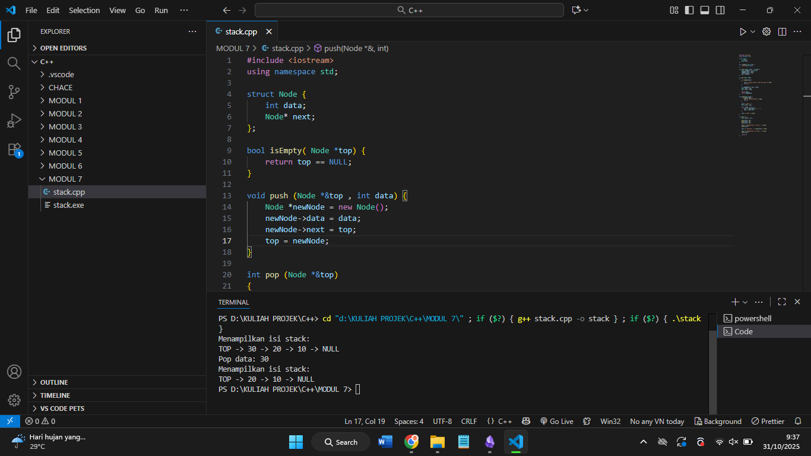
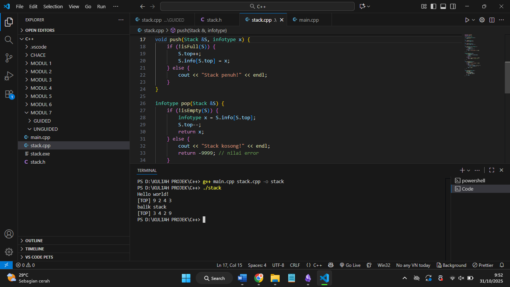
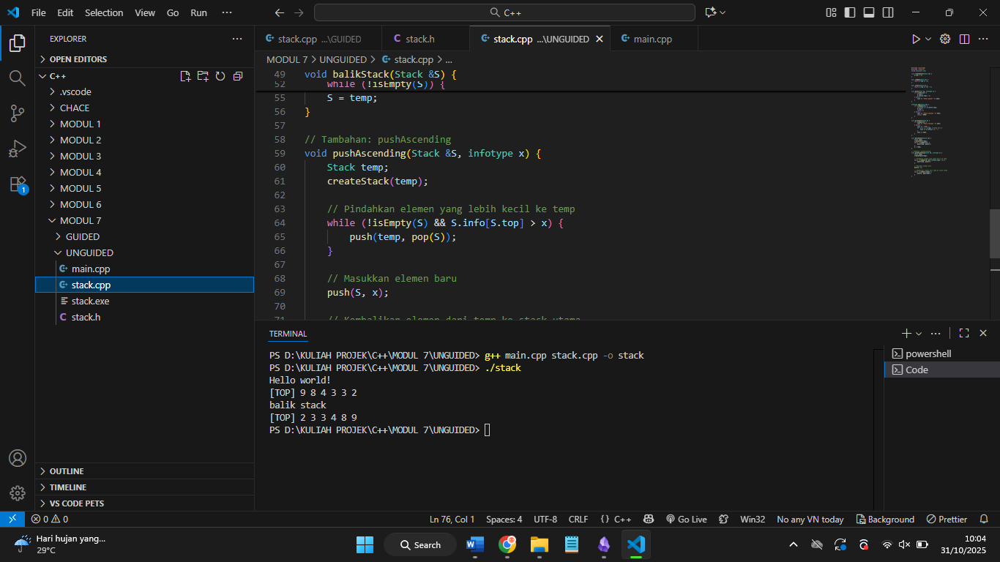
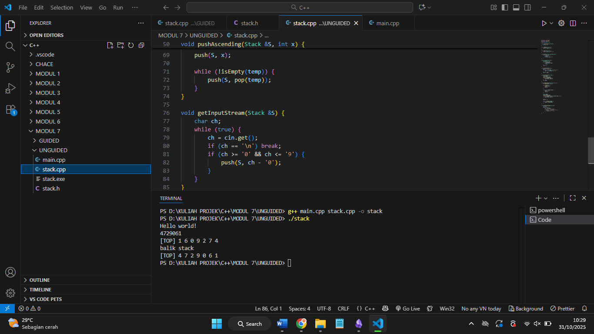

# Laporan Praktikum Stuktur Data MODUL 7 x Stack


Nama : Rifa Cahya Ariby 

NIM : 103112400268

Kelas : S1 IF12 07

---

## Dasar Teori

### Stack

Stack merupakan struktur data linier yang bekerja dengan prinsip Last In First Out (LIFO), artinya data yang terakhir dimasukkan adalah data pertama yang akan dikeluarkan. Bayangkan seperti tumpukan piring: piring terakhir yang ditumpuk di atas harus diambil dulu sebelum piring yang ada di bawahnya. Stack biasanya digunakan untuk menyimpan data sementara dengan operasi penambahan (push) dan penghapusan (pop) hanya terjadi di bagian atas tumpukan. Struktur ini banyak dipakai dalam berbagai aplikasi seperti manajemen panggilan fungsi, undo/redo pada perangkat lunak, dan rekursi dalam pemrograman.
Berikut gambaran operasi push dan pop


 


#### Primitif-Primitif dalam Stack
Primitif-primitif dalam stack pada dasarnya sama dengan primitif-primitif pada list lainnya. Malahan
primitif dalam stack lebih sedikit, karena dalam stack hanya melakukan operasi-operasi terhadap
elemen paling atas.
Primitif -primitif dalam stack :
1. createStack().
2. isEmpty().
3. alokasi().
4. dealokasi().
5. Fungsi – fungsi pencarian.
6. Dan fungsi – fungsi primitif lainnya.
Seperti halnya pada model list yang lain, primitif-primitifnya tersimpan pada file *.c dan file *.h.


## Guided

``` cpp
#include <iostream>

using namespace std;

  

struct Node {

    int data;

    Node* next;

};

  

bool isEmpty( Node *top) {

    return top == NULL;

}

  

void push (Node *&top , int data) {

    Node *newNode = new Node();

    newNode->data = data;

    newNode->next = top;

    top = newNode;

}

  

int pop (Node *&top)

{

    if (isEmpty(top))

    {

        cout << "Stack kosong, tidak bisa pop" << endl;

        return 0;

    }

  

    int poppedData = top -> data;

    Node *temp = top;

    top = top -> next;

  

    delete temp;

    return poppedData;

}

  

void show(Node *top) {

    if (isEmpty(top)) {

        cout << "Stack kosong" << endl;

        return;

    }

  

    cout << "TOP -> ";

    Node *temp = top;

  

    while (temp != NULL) {

        cout << temp->data << " -> ";

        temp = temp->next;

    }

  

    cout << "NULL" << endl;

}

  

int main () {

    Node *stack = NULL;

  

    push(stack, 10);

    push(stack, 20);

    push(stack, 30);

  

    cout << "Menampilkan isi stack: " << endl;

    show(stack);

  

    cout << "Pop data: " << pop(stack) << endl;

    cout << "Menampilkan isi stack: " << endl;

    show(stack);

  

    return 0;

}
```

## Output


Program ini membuat sebuah struktur data stack menggunakan linked list. Setiap elemen stack disimpan dalam node yang berisi data dan penunjuk ke node berikutnya. Fungsi push menambahkan elemen baru ke atas stack, sedangkan pop menghapus dan mengembalikan elemen teratas. Fungsi isEmpty mengecek apakah stack kosong. Fungsi show menampilkan semua elemen stack dari atas ke bawah. Di bagian utama, program memasukkan beberapa data ke dalam stack, menampilkan isinya, menghapus satu elemen teratas, lalu menampilkan isi stack yang tersisa.

## Unguided
### Soal 1

Buatlah ADT Stack menggunakan ARRAY sebagai berikut di dalam file “stack.h”:

``` 
Type infotype : integer
Type Stack <
info : array [20] of integer
top : integer
>
procedure CreateStack( input/output S : Stack )
procedure push(input/output S : Stack,
input x : infotype)
function pop(input/output t S : Stack )
→ infotype
procedure printInfo( input S : Stack )
procedure balikStack(input/output S :
Stack )
```

### Stack.h

``` h
#ifndef STACK_H

#define STACK_H

  

#define MAX 20

typedef int infotype;

  

typedef struct {

    infotype info[MAX];

    int top;

} Stack;

  

void createStack(Stack &S);

void push(Stack &S, infotype x);

infotype pop(Stack &S);

void printInfo(Stack S);

void balikStack(Stack &S);

  

#endif
```

### Stuck.cpp

``` cpp
#include <iostream>

#include "stack.h"

using namespace std;

  

void createStack(Stack &S) {

    S.top = -1;

}

  

bool isEmpty(Stack S) {

    return S.top == -1;

}

  

bool isFull(Stack S) {

    return S.top == MAX - 1;

}

  

void push(Stack &S, infotype x) {

    if (!isFull(S)) {

        S.top++;

        S.info[S.top] = x;

    } else {

        cout << "Stack penuh!" << endl;

    }

}

  

infotype pop(Stack &S) {

    if (!isEmpty(S)) {

        infotype x = S.info[S.top];

        S.top--;

        return x;

    } else {

        cout << "Stack kosong!" << endl;

        return -9999; // nilai error

    }

}

  

void printInfo(Stack S) {

    if (isEmpty(S)) {

        cout << "Stack kosong!" << endl;

    } else {

        cout << "[TOP] ";

        for (int i = S.top; i >= 0; i--) {

            cout << S.info[i] << " ";

        }

        cout << endl;

    }

}

  

void balikStack(Stack &S) {

    Stack temp;

    createStack(temp);

    while (!isEmpty(S)) {

        push(temp, pop(S));

    }

    S = temp;

}
```

### Main.cpp
``` cpp
#include <iostream>

#include "stack.h"

using namespace std;

  

int main() {

    cout << "Hello world!" << endl;

  

    Stack S;

    createStack(S);

  

    push(S, 3);

    push(S, 4);

    push(S, 8);

    pop(S);

    push(S, 2);

    push(S, 3);

    pop(S);

    push(S, 9);

  

    printInfo(S);

  

    cout << "balik stack" << endl;

    balikStack(S);

    printInfo(S);

  

    return 0;

}
```


### Output




> Program ini merupakan implementasi **ADT Stack menggunakan array** yang terdiri dari tiga file, yaitu `stack.h`, `stack.cpp`, dan `main.cpp`.  
> File `stack.h` berisi **rancangan struktur dan fungsi Stack**, seperti `createStack`, `push`, `pop`, `printInfo`, dan `balikStack`.  
> File `stack.cpp` berisi **implementasi logika dari fungsi-fungsi tersebut**, yaitu membuat stack kosong, menambah elemen ke atas stack, menghapus elemen teratas, menampilkan isi stack, dan membalik urutan elemen stack.  
> Sedangkan file `main.cpp` berfungsi sebagai **program utama** untuk menguji semua operasi stack dengan menambahkan, menghapus, menampilkan, serta membalik isi stack.  
> Secara keseluruhan, program ini menunjukkan cara kerja **struktur data Stack (LIFO — Last In, First Out)**, di mana data yang terakhir dimasukkan akan keluar terlebih dahulu.


### Soal 2
Tambahkan prosedur pushAscending( in/out S : Stack, in x : integer)
```
int main()
{
cout << "Hello world!" << endl;
Stack S;
createStack(S);
pushAscending(S,3);
pushAscending(S,4);
pushAscending(S,8);
pushAscending(S,2);
pushAscending(S,3);
pushAscending(S,9);
printInfo(S);
cout<<"balik stack"<<endl;
balikStack(S);
printInfo(S);
return 0;
}
```


### Stack.h
``` h
#ifndef STACK_H

#define STACK_H

  

#define MAX 20

typedef int infotype;

  

typedef struct {

    infotype info[MAX];

    int top;

} Stack;

  

void createStack(Stack &S);

void push(Stack &S, infotype x);

infotype pop(Stack &S);

void printInfo(Stack S);

void balikStack(Stack &S);

void pushAscending(Stack &S, infotype x);

  

#endif 

```

### Stack.cpp
``` cpp
#include <iostream>

#include "stack.h"

using namespace std;

  

void createStack(Stack &S) {

    S.top = -1;

}

  

bool isEmpty(Stack S) {

    return S.top == -1;

}

  

bool isFull(Stack S) {

    return S.top == MAX - 1;

}

  

void push(Stack &S, infotype x) {

    if (!isFull(S)) {

        S.top++;

        S.info[S.top] = x;

    } else {

        cout << "Stack penuh!" << endl;

    }

}

  

infotype pop(Stack &S) {

    if (!isEmpty(S)) {

        infotype x = S.info[S.top];

        S.top--;

        return x;

    } else {

        cout << "Stack kosong!" << endl;

        return -9999;

    }

}

  

void printInfo(Stack S) {

    if (isEmpty(S)) {

        cout << "Stack kosong!" << endl;

    } else {

        cout << "[TOP] ";

        for (int i = S.top; i >= 0; i--) {

            cout << S.info[i] << " ";

        }

        cout << endl;

    }

}

  

void balikStack(Stack &S) {

    Stack temp;

    createStack(temp);

    while (!isEmpty(S)) {

        push(temp, pop(S));

    }

    S = temp;

}

  

// Tambahan: pushAscending

void pushAscending(Stack &S, infotype x) {

    Stack temp;

    createStack(temp);

  

    // Pindahkan elemen yang lebih kecil ke temp

    while (!isEmpty(S) && S.info[S.top] > x) {

        push(temp, pop(S));

    }

  

    // Masukkan elemen baru

    push(S, x);

  

    // Kembalikan elemen dari temp ke stack utama

    while (!isEmpty(temp)) {

        push(S, pop(temp));

    }

}
```
### Main.cpp
``` cpp
#include <iostream>

#include "stack.h"

using namespace std;

  

int main() {

    cout << "Hello world!" << endl;

  

    Stack S;

    createStack(S);

  

    pushAscending(S, 3);

    pushAscending(S, 4);

    pushAscending(S, 8);

    pushAscending(S, 2);

    pushAscending(S, 3);

    pushAscending(S, 9);

  

    printInfo(S);

  

    cout << "balik stack" << endl;

    balikStack(S);

    printInfo(S);

  

    return 0;

}
```
### Output


### Soal 3
Tambahkan prosedur getInputStream( in/out S : Stack ). Prosedur akan terus membaca dan
menerima input user dan memasukkan setiap input ke dalam stack hingga user menekan
tombol enter. Contoh: gunakan cin.get() untuk mendapatkan inputan user.

```
int main()
{
cout << "Hello world!" << endl;
Stack S;
createStack(S);
getInputStream(S);
printInfo(S);
cout<<"balik stack"<<endl;
balikStack(S);
printInfo(S);
return 0;
}
```

### Stack.h
``` h
#ifndef STACK_H

#define STACK_H

  

#define MAX 20

typedef int infotype;

  

struct Stack {

    infotype info[MAX];

    int top;

};

  

// Deklarasi prosedur & fungsi

void createStack(Stack &S);

bool isEmpty(Stack S);

bool isFull(Stack S);

void push(Stack &S, infotype x);

infotype pop(Stack &S);

void printInfo(Stack S);

void balikStack(Stack &S);

void pushAscending(Stack &S, int x);

void getInputStream(Stack &S);

  

#endif
```

### Stack.cpp
``` cpp
#include <iostream>

#include "stack.h"

using namespace std;

  

void createStack(Stack &S) {

    S.top = -1;

}

  

bool isEmpty(Stack S) {

    return S.top == -1;

}

  

bool isFull(Stack S) {

    return S.top == MAX - 1;

}

  

void push(Stack &S, infotype x) {

    if (!isFull(S)) {

        S.top++;

        S.info[S.top] = x;

    }

}

  

infotype pop(Stack &S) {

    infotype x = -1;

    if (!isEmpty(S)) {

        x = S.info[S.top];

        S.top--;

    }

    return x;

}

  

void printInfo(Stack S) {

    cout << "[TOP] ";

    for (int i = S.top; i >= 0; i--) {

        cout << S.info[i] << " ";

    }

    cout << endl;

}

  

void balikStack(Stack &S) {

    Stack temp;

    createStack(temp);

    while (!isEmpty(S)) {

        push(temp, pop(S));

    }

    S = temp;

}

  

void pushAscending(Stack &S, int x) {

    if (isFull(S)) return;

  

    if (isEmpty(S)) {

        push(S, x);

        return;

    }

  

    if (x >= S.info[S.top]) {

        push(S, x);

        return;

    }

  

    Stack temp;

    createStack(temp);

    while (!isEmpty(S) && S.info[S.top] > x) {

        push(temp, pop(S));

    }

  

    push(S, x);

  

    while (!isEmpty(temp)) {

        push(S, pop(temp));

    }

}

  

void getInputStream(Stack &S) {

    char ch;

    while (true) {

        ch = cin.get();

        if (ch == '\n') break;

        if (ch >= '0' && ch <= '9') {

            push(S, ch - '0');

        }

    }

}

```

### Main.cpp
``` cpp
#include <iostream>

#include "stack.h"

using namespace std;

  

int main() {

    cout << "Hello world!" << endl;

    Stack S;

    createStack(S);

  

    getInputStream(S);

    printInfo(S);

  

    cout << "balik stack" << endl;

    balikStack(S);

    printInfo(S);

  

    return 0;

}
```

### Output



Program pada tiga soal di atas merupakan implementasi **ADT Stack menggunakan array** yang terdiri dari beberapa operasi dasar seperti membuat stack, menambah dan menghapus elemen, menampilkan isi stack, serta membalik urutan data.

Pada program pertama, dibuat struktur stack dan prosedur dasar (`createStack`, `push`, `pop`, `printInfo`, dan `balikStack`) untuk mengelola data bertipe integer.  
Program kedua menambahkan prosedur `pushAscending` agar setiap data yang dimasukkan selalu tersusun secara menaik di dalam stack.  
Kemudian, program ketiga menambahkan prosedur `getInputStream` yang membaca input angka dari pengguna menggunakan `cin.get()` hingga menekan Enter, lalu menampilkannya dalam urutan stack dan hasil pembalikannya.

Secara keseluruhan, ketiga program ini menunjukkan perkembangan bertahap dalam pengelolaan struktur data stack mulai dari operasi dasar, penambahan aturan urutan data, hingga pengambilan input dinamis dari pengguna.

## Referensi

1. Modul Praktikum
2. https://www.trivusi.web.id/2022/07/struktur-data-stack.html
3. https://codepolitan.com/blog/apa-itu-stack-dalam-ilmu-pemrograman
4. https://www.mahirkoding.com/struktur-data-stack-dan-implementasinya/
