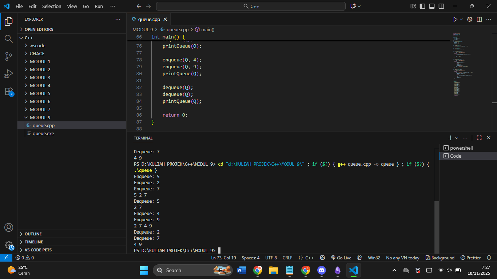
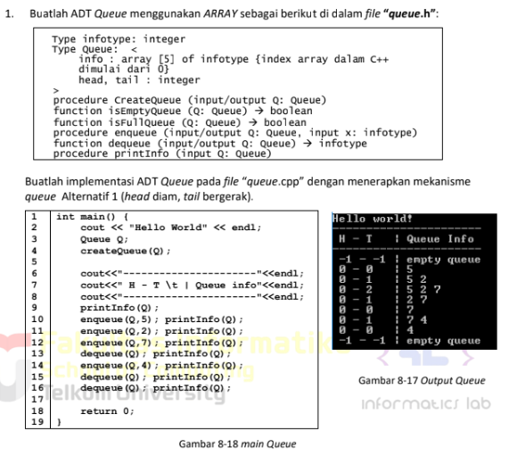
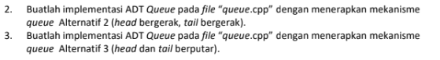
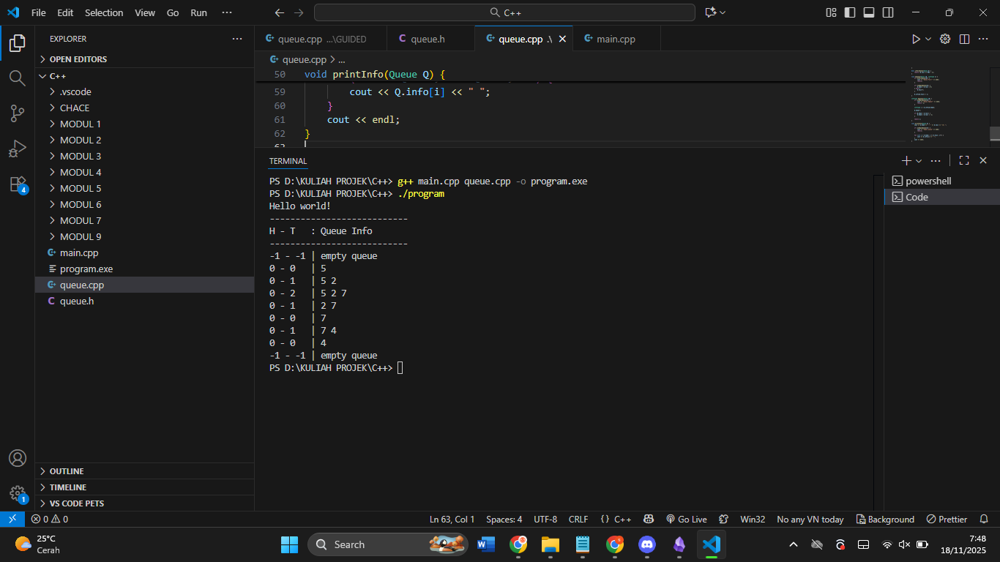
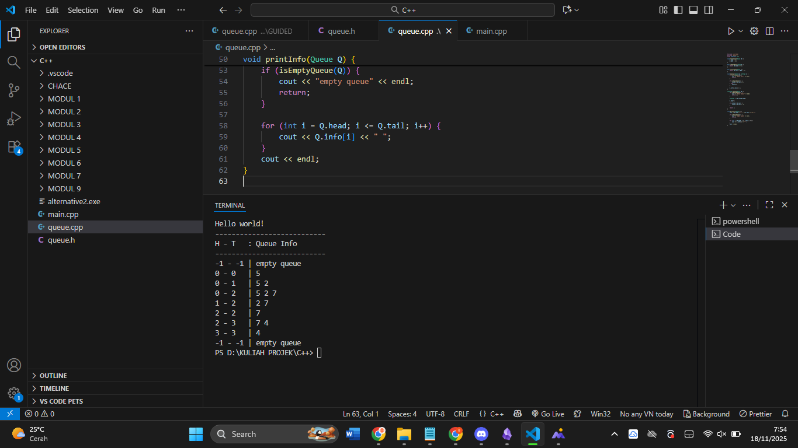
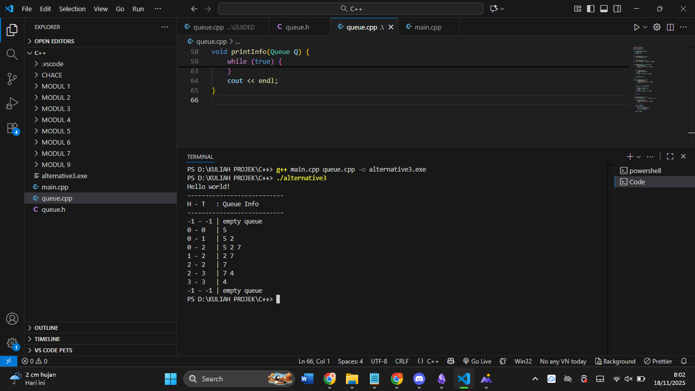

# Laporan Praktikum Stuktur Data MODUL 8 x Queue


Nama : Rifa Cahya Ariby 

NIM : 103112400268

Kelas : S1 IF12 07

---

## Dasar Teori
### Queue

Queue dalam pemrograman adalah struktur data yang mengatur elemen berdasarkan prinsip FIFO (First In, First Out), artinya elemen yang pertama masuk ke dalam antrian akan menjadi elemen yang pertama keluar dari antrian. Queue sering digunakan untuk mengelola proses secara berurutan, menyimpan data sementara, atau menangani permintaan pengguna secara bergantian.

## Guided
### Queue

``` cpp
#include <iostream>

using namespace std;

  

#define MAX 5

  

struct Queue {

    int data[MAX];

    int head;

    int tail;

};

  

void createQueue(Queue &Q) {

    Q.head = -1;

    Q.tail = -1;

}

  

bool isEmpty(Queue Q) {

    return (Q.head == -1 && Q.tail == -1);

}

  

bool isFull(Queue Q) {

    return (Q.tail == MAX - 1);

}

  

void printQueue(Queue Q) {

    if (isEmpty(Q)) {

        cout << "Queue Kosong\n";

    } else {

        for (int i = Q.head; i <= Q.tail; i++) {

            cout << Q.data[i] << " ";

        }

        cout << endl;

    }

}

  

void enqueue(Queue &Q, int x) {

    if (isFull(Q)) {

        cout << "Queue Penuh\n";

    } else {

        if (isEmpty(Q)) {

            Q.head = Q.tail = 0;

        } else {

            Q.tail++;

        }

        Q.data[Q.tail] = x;

        cout << "Enqueue: " << x << endl;

    }

}

  

void dequeue(Queue &Q) {

    if (isEmpty(Q)) {

        cout << "Queue Kosong\n";

    } else {

        cout << "Dequeue: " << Q.data[Q.head] << endl;

        if (Q.head == Q.tail) {

            Q.head = Q.tail = -1;

        } else {

            for (int i = Q.head; i < Q.tail; i++) {

                Q.data[i] = Q.data[i + 1];

            }

            Q.tail--;

        }

    }

}

  

int main() {

    Queue Q;

    createQueue(Q);

  

    enqueue(Q, 5);

    enqueue(Q, 2);

    enqueue(Q, 7);

    printQueue(Q);

  

    dequeue(Q);

    printQueue(Q);

  

    enqueue(Q, 4);

    enqueue(Q, 9);

    printQueue(Q);

  

    dequeue(Q);

    dequeue(Q);

    printQueue(Q);

  

    return 0;

}
```


### Output


> Program di atas adalah implementasi struktur data queue menggunakan array dalam C++. Queue ini memiliki kapasitas maksimal5 elemen, dengan variabel head dan tail untuk menandai posisi awal dan akhir antrian. Fungsi utama meliputi pembuatan queue, pengecekan apakah queue kosong atau penuh, menampilkan isi queue, menambahkan elemen (enqueue), dan menghapus elemen (dequeue). Saat elemen dihapus, seluruh elemen setelahnya digeser ke kiri agar posisi tetap rapi. Program menunjukkan operasi dasar queue: menambahkan, menghapus, dan menampilkan elemen secara FIFO (First In, First Out).

## Unguided

## Soal 1




### Queue.h
``` h
// queue.h

  

#ifndef QUEUE_H

#define QUEUE_H

  

const int MAX = 5;

  

typedef int infotype;

  

struct Queue {

    infotype info[MAX];

    int head;

    int tail;

};

  

// Prototype

void CreateQueue(Queue &Q);

bool isEmptyQueue(Queue Q);

bool isFullQueue(Queue Q);

  

void enqueue(Queue &Q, infotype x);

infotype dequeue(Queue &Q);

void printInfo(Queue Q);

  

#endif
```

### main.cpp

``` cpp
#include <iostream>

#include "queue.h"

using namespace std;

  

int main() {

    cout << "Hello world!" << endl;

    cout << "---------------------------" << endl;

    cout << "H - T\t: Queue Info" << endl;

    cout << "---------------------------" << endl;

  

    Queue Q;

    CreateQueue(Q);

    printInfo(Q);

  

    enqueue(Q, 5);  printInfo(Q);

    enqueue(Q, 2);  printInfo(Q);

    enqueue(Q, 7);  printInfo(Q);

  

    dequeue(Q);     printInfo(Q);

    dequeue(Q);     printInfo(Q);

  

    enqueue(Q, 4);  printInfo(Q);

  

    dequeue(Q);     printInfo(Q);

    dequeue(Q);     printInfo(Q);

  

    return 0;

}
```

## Alternative 1
### Queue.cpp

``` cpp
#include <iostream>

#include "queue.h"

using namespace std;

  

void CreateQueue(Queue &Q) {

    Q.head = -1;

    Q.tail = -1;

}

  

bool isEmptyQueue(Queue Q) {

    return (Q.tail == -1);

}

  

bool isFullQueue(Queue Q) {

    return (Q.tail == MAX - 1);

}

  

void enqueue(Queue &Q, infotype x) {

    if (isFullQueue(Q)) {

        cout << "Queue Full!" << endl;

        return;

    }

  

    if (isEmptyQueue(Q)) {

        Q.head = 0;

        Q.tail = 0;

    } else {

        Q.tail++;

    }

  

    Q.info[Q.tail] = x;

}

  

infotype dequeue(Queue &Q) {

    if (isEmptyQueue(Q)) {

        cout << "Queue Empty!" << endl;

        return -1;

    }

  

    infotype x = Q.info[Q.head];

  

    for (int i = 0; i < Q.tail; i++) {

        Q.info[i] = Q.info[i + 1];

    }

  

    Q.tail--;

  

    if (Q.tail < 0) {

        Q.head = Q.tail = -1;

    }

  

    return x;

}

  

void printInfo(Queue Q) {

    cout << Q.head << " - " << Q.tail << "\t| ";

  

    if (isEmptyQueue(Q)) {

        cout << "empty queue" << endl;

        return;

    }

  

    for (int i = 0; i <= Q.tail; i++) {

        cout << Q.info[i] << " ";

    }

    cout << endl;

}
```

### Output



## Alternative 2
## Queue.cpp

``` cpp
#include <iostream>

#include "queue.h"

using namespace std;

  

void CreateQueue(Queue &Q) {

    Q.head = -1;

    Q.tail = -1;

}

  

bool isEmptyQueue(Queue Q) {

    return (Q.head == -1);

}

  

bool isFullQueue(Queue Q) {

    return (Q.tail == MAX - 1);

}

  

void enqueue(Queue &Q, infotype x) {

    if (isFullQueue(Q)) {

        cout << "Queue Full!" << endl;

        return;

    }

  

    if (isEmptyQueue(Q)) {

        Q.head = Q.tail = 0;

    } else {

        Q.tail++;

    }

  

    Q.info[Q.tail] = x;

}

  

infotype dequeue(Queue &Q) {

    if (isEmptyQueue(Q)) {

        cout << "Queue Empty!" << endl;

        return -1;

    }

  

    infotype x = Q.info[Q.head];

  

    Q.head++;

  

    if (Q.head > Q.tail) {

        Q.head = Q.tail = -1;

    }

  

    return x;

}

  

void printInfo(Queue Q) {

    cout << Q.head << " - " << Q.tail << "\t| ";

  

    if (isEmptyQueue(Q)) {

        cout << "empty queue" << endl;

        return;

    }

  

    for (int i = Q.head; i <= Q.tail; i++) {

        cout << Q.info[i] << " ";

    }

    cout << endl;

}
```

### Output




## Alternative 3

### Queue.cpp
``` cpp
#include <iostream>
#include "queue.h"
using namespace std;

void CreateQueue(Queue &Q) {
    Q.head = -1;
    Q.tail = -1;
}

bool isEmptyQueue(Queue Q) {
    return (Q.head == -1);
}

bool isFullQueue(Queue Q) {
    return ((Q.tail + 1) % MAX == Q.head);
}

void enqueue(Queue &Q, infotype x) {
    if (isFullQueue(Q)) {
        cout << "Queue Full!" << endl;
        return;
    }

    if (isEmptyQueue(Q)) {
        Q.head = Q.tail = 0;
    } else {
        Q.tail = (Q.tail + 1) % MAX;
    }

    Q.info[Q.tail] = x;
}

infotype dequeue(Queue &Q) {
    if (isEmptyQueue(Q)) {
        cout << "Queue Empty!" << endl;
        return -1;
    }

    infotype x = Q.info[Q.head];

    if (Q.head == Q.tail) {
        Q.head = Q.tail = -1;
    } else {
        Q.head = (Q.head + 1) % MAX;
    }

    return x;
}

void printInfo(Queue Q) {
    cout << Q.head << " - " << Q.tail << "\t| ";

    if (isEmptyQueue(Q)) {
        cout << "empty queue" << endl;
        return;
    }

    int i = Q.head;
    while (true) {
        cout << Q.info[i] << " ";
        if (i == Q.tail) break;
        i = (i + 1) % MAX;
    }
    cout << endl;
}

```

### Output



> Program di atas adalah implementasi struktur data **Queue (antrian)** dalam bahasa C++, tetapi dibuat dalam **tiga versi berbeda** karena setiap alternatif menggunakan cara yang berbeda dalam mengatur pergerakan _head_ dan _tail_. Semua alternatif memiliki fungsi yang sama—menambah data (_enqueue_), menghapus data (_dequeue_), memeriksa kosong atau penuh, dan menampilkan isi queue—tetapi cara kerja internalnya berbeda sehingga menghasilkan bentuk output yang berbeda pula.
> 
> Pada **Alternatif 1**, queue dibuat dengan konsep yang paling sederhana. Nilai _head_ selalu berada pada indeks pertama (index 0) setelah queue berisi data. Jika dilakukan _dequeue_, seluruh elemen digeser ke kiri sehingga elemen terdepan selalu berada di posisi paling awal array. Karena selalu dirapatkan ke kiri, tampilan queue selalu rapi dan linear. Output dari alternatif ini akan terlihat persis seperti contoh di modul atau output yang kamu berikan.
> 
> Pada **Alternatif 2**, queue dibuat tanpa pergeseran elemen. Ketika dilakukan _enqueue_, _tail_ selalu bergerak ke kanan. Jika dilakukan _dequeue_, _head_ maju ke indeks berikutnya tanpa menggeser data lain. Akibatnya, elemen-elemen lama tetap berada di posisinya, tetapi hanya bagian antara _head_ dan _tail_ yang dianggap aktif. Cara ini lebih efisien karena tidak perlu memindahkan elemen, tetapi membuat bentuk output berbeda karena elemen tidak dimulai dari indeks 0 lagi.
> 
> Sementara itu, **Alternatif 3** menggunakan konsep **Circular Queue**, yaitu struktur antrian yang membuat head dan tail berputar menggunakan operasi modulo. Jika tail sudah mencapai ujung array, maka ia kembali ke indeks 0 selama slot tersebut masih kosong. Circular queue lebih efisien dalam penggunaan ruang karena memanfaatkan array secara melingkar, tetapi tampilan outputnya bisa terlihat "berputar" dan tidak selalu dalam urutan linear biasa. Elemen akan ditampilkan berdasarkan urutan logis, bukan berdasarkan indeks array yang berurutan.
> 
> Meskipun ketiga alternatif menghasilkan tampilan yang berbeda, inti program tetap sama: semua menjalankan operasi antrian dengan aturan FIFO (First In, First Out). Perbedaannya hanya pada cara memanfaatkan memori di array dan bagaimana head serta tail bergerak saat queue mengalami operasi enqueue atau dequeue.
> 

## Referensi

1. Modul Praktikum
2. https://bit.telkomuniversity.ac.id/queue-pengertian-fungsi-dan-jenisnya/
3. https://codingstudio.id/blog/struktur-data-queue-adalah/
4. https://www.revou.co/kosakata/queue
5. https://fikti.umsu.ac.id/struktur-data-queue-pengertian-fungsi-dan-jenisnya/
6. https://www.trivusi.web.id/2022/07/struktur-data-queue.html